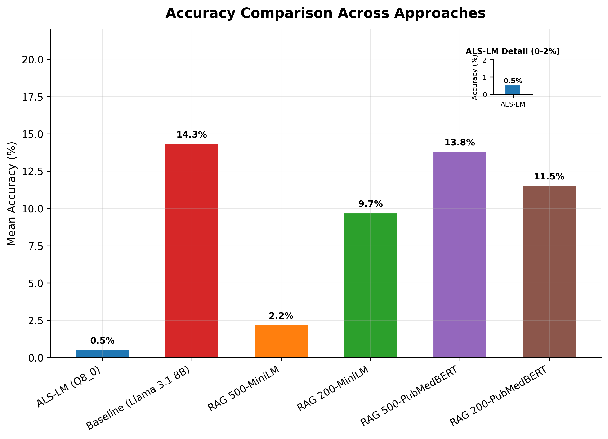
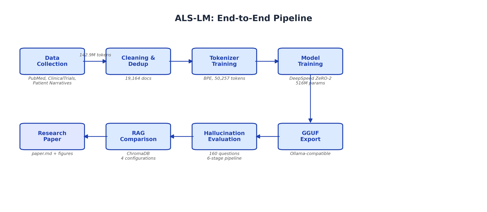
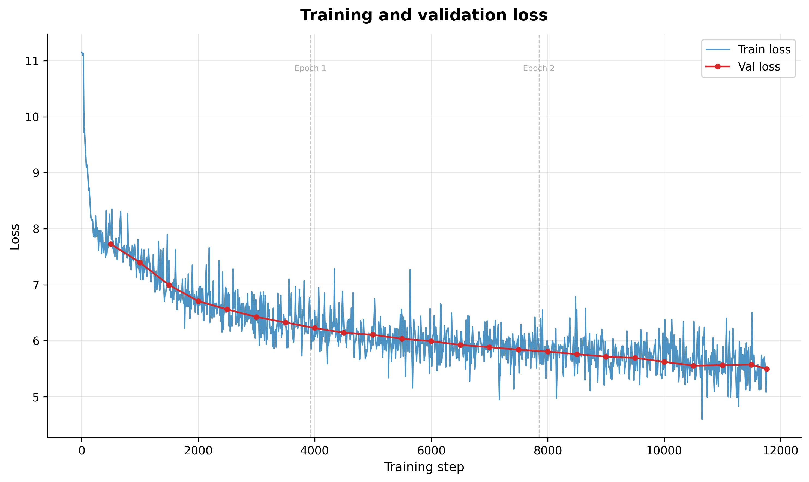
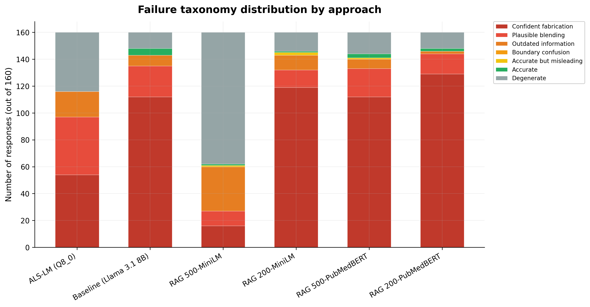

# ALS-LM: A domain-specific language model for ALS knowledge

ALS-LM is a 516M-parameter decoder-only transformer trained from scratch on 143M tokens of curated amyotrophic lateral sclerosis (ALS) research. The project investigates what a purpose-built model can learn from a narrow medical corpus, how it fails, and how its failure modes compare to retrieval-augmented generation (RAG). A controlled comparison experiment fine-tuning GPT-2 large (774M parameters) on the same corpus validates the data deficit hypothesis and reveals instruction-following as a separate failure dimension.

> [!CAUTION]
>
> This is a machine-learning research and education project, not a medical tool. It is an independent personal project and is not affiliated with any employer or medical institution. The models should never be used for clinical decision-making.
>
> *If you find an issue with this project's approach to medical content or data ethics, please open an issue. Constructive feedback on the ethical framework is especially welcome.*

## Key findings

The central result is a disconnect between language-modeling competence and factual knowledge. The model achieves a Well-fit training classification (validation loss relative gap of +0.42%), yet achieves a 0.0% binary pass rate on a 160-question factual benchmark. Naive RAG over the same corpus does not help: the best RAG configuration (13.8% accuracy) fails to exceed a no-retrieval baseline (14.3%), revealing retrieval quality as the primary bottleneck. Fine-tuning GPT-2 large on the same corpus achieves 15x higher accuracy (3.12%) but produces degenerate output in 97.5% of responses, revealing data deficit and instruction-following as two orthogonal failure dimensions.



*The fine-tuned GPT-2 large model is not shown in this figure; see the [cross-model comparison](#cross-model-comparison) table below.*

- **0.0% binary pass rate** across all quantization levels on the hallucination benchmark (0/480 responses)
- **Best RAG 13.8% vs. baseline 14.3%**, meaning that retrieval-augmented generation does not outperform the no-retrieval baseline
- **PubMedBERT outperforms MiniLM by 2.1x** for medical retrieval (12.7% vs. 5.9% mean accuracy)
- **80x below Chinchilla-optimal** data ratio (0.25 tokens/parameter vs. the recommended ~20)
- **3.12% mean accuracy with GPT-2 large fine-tuning**, meaning a 15x improvement over the from-scratch model, validating that pretrained knowledge helps even on a narrow medical corpus
- **97.5% degenerate output** from the fine-tuned model, indicating that instruction-following capability is not preserved through domain fine-tuning alone

## Pipeline

The project implements an end-to-end pipeline from data collection through evaluation, with every stage scripted and reproducible.



- **Data collection.** Scrapers for PubMed Central, ClinicalTrials.gov, and educational sources collect 19,164 documents into a standardized JSON format.
- **Data processing.** An 11-step source-aware cleaning pipeline handles deduplication (MinHash), normalization, filtering, and train/validation splitting (90/10).
- **Tokenizer training.** A custom BPE tokenizer (50,257 vocabulary) trained on the ALS corpus encodes 50 of the top 100 ALS-specific medical terms as single tokens.
- **Model training.** A GPT-2-style transformer with Pre-LN normalization (516M parameters) trains for 3 epochs by using DeepSpeed ZeRO Stage 2 with CPU offloading on an NVIDIA RTX 3060 (12GB VRAM).
- **Fine-tuning comparison.** GPT-2 large (774M parameters) fine-tuned on the same ALS corpus for 2 epochs by using DeepSpeed ZeRO Stage 2 with pretrained weights, serving as a controlled comparison against the from-scratch model.
- **Export.** A unified pipeline converts PyTorch checkpoints to Hugging Face format, then to GGUF (Q4_K_M, Q8_0, F16) for local inference via Ollama.
- **Evaluation.** A hallucination evaluation framework scores model responses against 160 curated questions by using key-fact fuzzy matching, entity-based fabrication detection (~48K entities), and a 5-mode failure taxonomy.
- **RAG comparison.** Four RAG configurations (two embedding models at two chunk sizes) that use ChromaDB are benchmarked against the from-scratch model and a no-retrieval Llama 3.1 8B baseline.

## Results

The results below summarize training performance, hallucination evaluation, and the RAG comparison experiment.

### Training

Training ran for 3 epochs (11,760 steps) in 4 hours 27 minutes on a single RTX 3060.



| Metric                | Value    |
|-----------------------|----------|
| Final training loss   | 5.4727   |
| Final validation loss | 5.4956   |
| Loss improvement      | 50.9%    |
| Train perplexity      | 238.09   |
| Validation perplexity | 243.63   |
| Perplexity gap        | 2.3%     |
| Classification        | Well-fit |

### Hallucination evaluation

All three quantization levels achieve 0.0% binary pass rate across the 160-question ALS benchmark.

**Table 1.** Hallucination evaluation results across three quantization levels. Mean accuracy uses proportional key-fact fuzzy matching (0-1). Binary pass rate counts questions where at least 50% of key facts were matched.

| Model           | Mean accuracy | Binary pass | Fabrication rate | Coherent responses |
|-----------------|---------------|-------------|------------------|--------------------|
| ALS-LM (F16)    |        0.0036 |       0.0%  |           65.2%  |   110/160 (68.8%)  |
| ALS-LM (Q8_0)   |        0.0021 |       0.0%  |           66.4%  |   108/160 (67.5%)  |
| ALS-LM (Q4_K_M) |        0.0052 |       0.0%  |           66.2%  |   116/160 (72.5%)  |

The failure taxonomy reveals three dominant modes: confident fabrication (33.1%), degenerate output (32.5%), and plausible blending (23.8%).



### RAG comparison

The best RAG configuration (500-token chunks with PubMedBERT) achieves 13.8% mean accuracy but does not exceed the no-retrieval Llama 3.1 8B baseline at 14.3%.

**Table 2.** Cross-approach accuracy comparison on the 160-question ALS benchmark. ALS-LM values use Q8_0 as the representative quantization level (all three levels produce equivalent results). Baseline is Llama 3.1 8B without retrieval.

| Approach                | Mean accuracy | Binary pass | Fabrication rate |
|-------------------------|---------------|-------------|------------------|
| ALS-LM (Q8_0)           |        0.0021 |       0.0%  |            66.4% |
| Baseline (no retrieval) |        0.1432 |      13.8%  |            87.2% |
| RAG 500-MiniLM          |        0.0219 |       1.9%  |            51.4% |
| RAG 200-MiniLM          |        0.0969 |       8.1%  |            81.0% |
| RAG 500-PubMedBERT      |        0.1380 |      10.6%  |            80.3% |
| RAG 200-PubMedBERT      |        0.1151 |      12.5%  |            84.0% |

Failure decomposition shows retrieval failures account for 52-89% of wrong answers depending on configuration, confirming retrieval quality as the primary bottleneck.

### Cross-model comparison

The following table compares all three approaches on the 160-question ALS benchmark at Q8_0 quantization. Degenerate output rate measures the proportion of responses that are incoherent (repetitive loops, token salad, or empty); this metric is not applicable to RAG configurations where Llama 3.1 8B generates coherent text.

| Approach                       | Mean accuracy | Fabrication rate | Degenerate output rate |
|--------------------------------|---------------|------------------|------------------------|
| ALS-LM 500M (from-scratch)    |        0.0021 |           66.4%  |                 32.5%  |
| GPT-2 large 774M (fine-tuned) |        0.0312 |           77.0%  |                 97.5%  |
| RAG 500-PubMedBERT            |        0.1380 |           80.3%  |                    —   |
| Baseline (no retrieval)       |        0.1432 |           87.2%  |                    —   |

## Getting started

The project requires Python 3.12, CUDA 12.x, and an NVIDIA GPU with at least 12GB VRAM. All training and inference run locally.

### Environment setup

This script validates system prerequisites, creates a virtual environment, installs PyTorch with CUDA support, builds DeepSpeed with the CPUAdam C++ extension, and installs remaining dependencies.

```bash
bash setup.sh
```

### Training

Train the 500M from-scratch model for 3 epochs with DeepSpeed ZeRO Stage 2.

```bash
deepspeed model/train.py --deepspeed --deepspeed_config config/ds_zero2.json --config 500M --max-epochs 3
```

### Fine-tuning (GPT-2 large)

Fine-tune GPT-2 large on the ALS corpus by using pretrained weights. Run `python scripts/load_gpt2_weights.py` first to download the pretrained checkpoint.

```bash
deepspeed model/train.py --deepspeed --deepspeed_config config/ds_zero2.json --config gpt2-large --pretrained-weights checkpoints/gpt2large_init/init.pt --max-epochs 2
```

### Export

Convert a PyTorch checkpoint to Hugging Face format, then to GGUF with multiple quantization levels, and optionally create an Ollama model.

```bash
python export/export_pipeline.py
```

### Interactive CLI

Launch the interactive CLI for querying the model. Requires an exported model registered with Ollama.

```bash
python demo/cli.py
```

### Evaluation

Run the 160-question hallucination benchmark against the model and generate Markdown and JSON reports.

```bash
python eval/run_evaluation.py
```

### Running the RAG comparison

Benchmark four RAG configurations against the from-scratch model and no-retrieval baseline.

```bash
python rag/compare_approaches.py
```

## Disclaimers

Please read the following disclaimers carefully before using or referencing ALS-LM.

### This is not a medical resource

ALS-LM is a machine-learning research project. It is **not** a diagnostic tool, treatment guide, or substitute for professional medical advice. The models generate text that sounds authoritative but is factually incorrect—the from-scratch model achieves 0.0% binary pass rate on our benchmark while the fine-tuned variant achieves only 1.87% with 97.5% of responses being degenerate.

**If you or someone you know is affected by ALS, please consult qualified healthcare providers and trusted resources such as:**

- [ALS Association](https://www.als.org/)
- [Mayo Clinic – ALS overview](https://www.mayoclinic.org/diseases-conditions/amyotrophic-lateral-sclerosis/symptoms-causes/syc-20354022)
- [NIH National Institute of Neurological Disorders and Stroke](https://www.ninds.nih.gov/health-information/disorders/amyotrophic-lateral-sclerosis-als)

### On hallucinations and medical safety

The from-scratch model hallucinates at a rate of 66.4% fabricated entities across all quantization levels. The fine-tuned GPT-2 large variant produces 77.0% fabrication among coherent responses, but only generates coherent responses 2.5% of the time. In a medical context, both models represent a potential harm. This project treats hallucination measurement as a primary research question, not a side effect to be minimized.

All model outputs should be treated as experimental results, not as medical information.

### Data ethics

All training data is sourced from publicly available, appropriately licensed material.

| Source               | Type                    | License/access                |
|----------------------|-------------------------|-------------------------------|
| PubMed Central       | Research papers         | Open Access subset            |
| ClinicalTrials.gov   | Clinical trial records  | Public domain (US government) |
| Educational sources  | Patient/medical content | Public web content            |

The project does not use private medical records, content from private support groups, data from communities where participants had a reasonable expectation of privacy, or any data subject to HIPAA or equivalent protections.

### Patient narrative policy

When including patient perspectives, this project only uses content that individuals have intentionally published for public audiences. The project does not attempt to simulate or generate patient voices. Any outputs from the model should be understood as machine-generated text, not patient experiences.

## Project documents

| Document                                                          | Description                                       |
|-------------------------------------------------------------------|---------------------------------------------------|
| [Research paper](docs/v1-research-paper.md)                          | Full experimental results and analysis            |
| [Model card](docs/v1-model-card.md)                                     | Model documentation, safety, and limitations      |
| [White paper](docs/v1-white-paper.md)                                | Research motivation, approach, and contributions  |
| [Product requirements document](docs/v1-product-requirements-doc.md) | Scope, requirements, and success criteria         |
| [Design document](docs/v1-design-doc.md)                             | Technical architecture and implementation details |

## License

Code in this repository is released under the MIT License. Training data sources retain their original licenses as documented in [data/sources.md](data/sources.md). Model weights, if published, will include the disclaimers outlined in this README.
