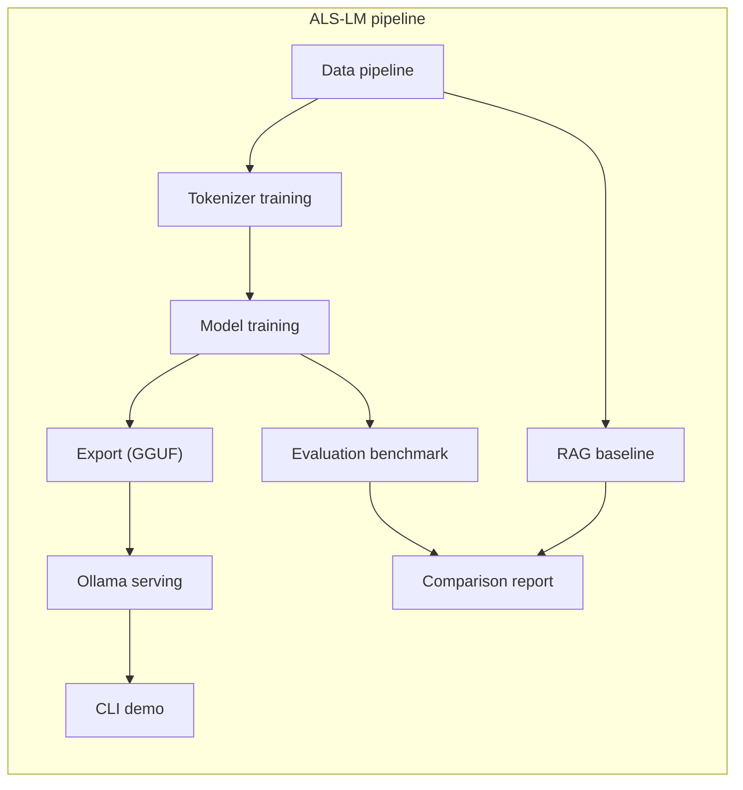
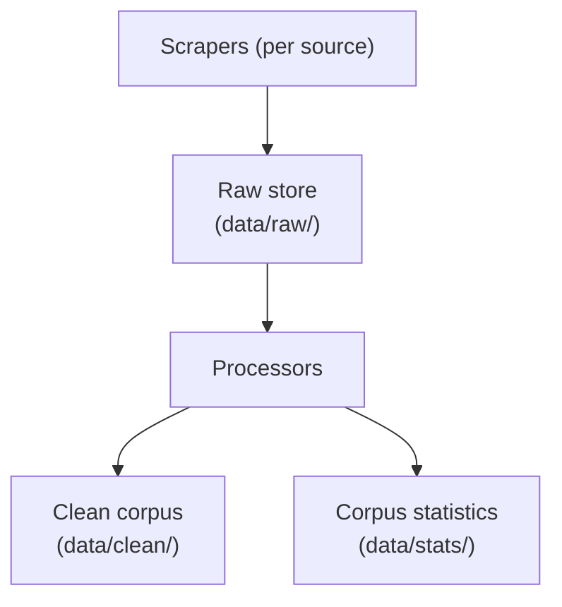
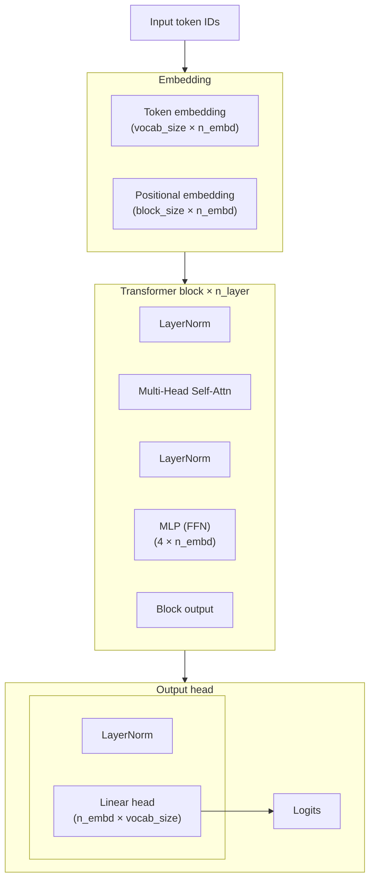
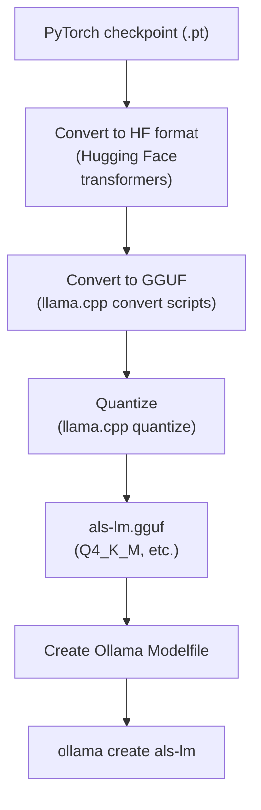
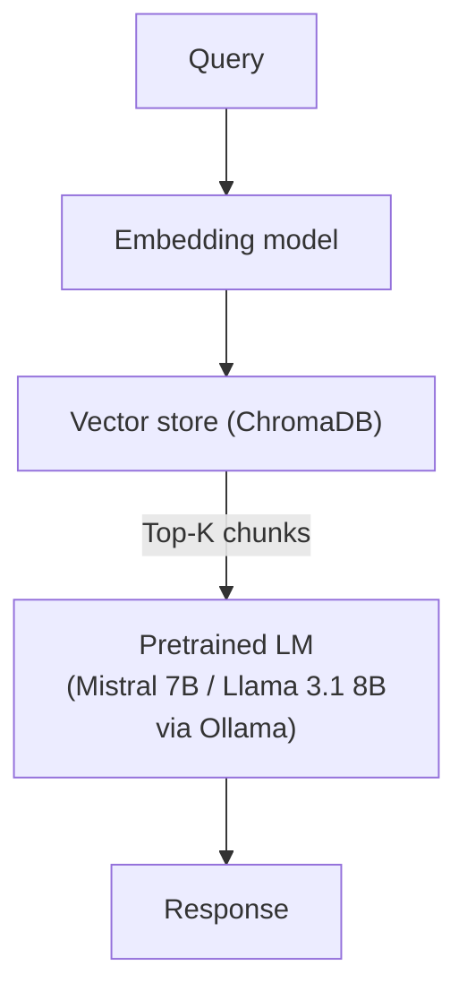

# ALS-LM: Design document

**Author:** [josh-wong](https://github.com/josh-wong)
**Date:** February 21, 2026
**Status:** Approved
**Version:** 1.0

---

## 1. Overview

This document describes the technical architecture and implementation plan for ALS-LM, a domain-specific language model trained from scratch on ALS (amyotrophic lateral sclerosis) research and educational content. It covers the full pipeline from data collection through model export and evaluation, and is intended to be read alongside the [white paper](white-paper.md) and [product requirements document](product-requirements-doc.md).

### 1.1 System context

The following diagram illustrates the overall system context and pipeline for ALS-LM.



### 1.2 Hardware constraints

This section describes the hardware constraints and their implications for the project.

All development and training runs on a single consumer-grade machine:

| Component | Spec                                 | Implication                                                                                                   |
|-----------|--------------------------------------|---------------------------------------------------------------------------------------------------------------|
| GPU       | NVIDIA RTX 3060, 12GB VRAM           | Primary bottleneck. Limits in-VRAM model size to ~500M params natively. Larger models require CPU offloading. |
| RAM       | 64GB DDR4                            | Key asset for DeepSpeed CPU offloading. Allows optimizer states and gradients to spill to system memory.      |
| CPU       | Intel i5-12400 (6 cores, 12 threads) | Adequate for data processing. Not a training bottleneck with GPU offloading.                                  |
| OS        | Windows 11 + WSL2 (Ubuntu)           | Training runs in WSL2 for Linux tool compatibility. GPU passthrough supported natively.                       |
| Storage   | SSD                                  | Important for data loading speed during training. Minimum 50GB free recommended.                              |

### 1.3 Development environment

The development environment is set up to ensure reproducibility and compatibility with required tools.

```
Windows 11
└── WSL2 (Ubuntu 22.04+)
    ├── Miniconda (Python 3.11)
    ├── CUDA Toolkit 12.x
    ├── PyTorch 2.x (with CUDA support)
    ├── DeepSpeed
    └── Ollama (Linux build)
```

Environment setup is scripted in `scripts/setup_env.sh` for reproducibility.

## 2. Data pipeline

This section outlines the data pipeline, including collection, processing, and storage.

### 2.1 Architecture

The architecture below shows the flow of data from scraping to corpus statistics.



All scrapers write raw data to `data/raw/{source_name}/` in a consistent JSON format:

```json
{
  "id": "unique-doc-id",
  "source": "pubmed",
  "url": "https://...",
  "title": "...",
  "text": "...",
  "date_accessed": "2026-02-16",
  "license": "CC-BY-4.0",
  "metadata": {}
}
```

### 2.2 Source-specific scrapers

This section details the scrapers used for each data source.

#### 2.2.1 PubMed Central (primary source)

PubMed Central is the primary source for biomedical research literature in the ALS-LM corpus.

- **API:** NCBI E-utilities (esearch + efetch)
- **Query strategy:** Search for ALS-related papers in the open-access subset by using MeSH terms and keyword combinations:
  - `"amyotrophic lateral sclerosis"[MeSH]`
  - `"motor neuron disease"[MeSH]`
  - `"ALS" AND ("genetics" OR "treatment" OR "diagnosis" OR "pathology")`
- **Filters:**
  - Open-access subset only (license: CC-BY, CC-BY-NC, or public domain)
  - Full-text XML available
  - Prioritize review articles and meta-analyses (publication type filter)
- **Processing notes:**
  - Parse JATS XML format to extract body text, stripping figures, tables, and reference lists
  - Retain abstracts as separate training examples (they're dense knowledge summaries)
  - Rate limit: NCBI requires ≤3 requests/second without API key, ≤10 with key

**Estimated yield:** 5,000–15,000 papers → 40–50MB clean text

```python
# Pseudocode for PubMed scraper
class PubMedScraper:
    BASE_URL = "https://eutils.ncbi.nlm.nih.gov/entrez/eutils"

    def search(self, query, max_results=10000):
        """Search PMC for article IDs matching query."""
        # esearch endpoint returns PMC IDs
        # Paginate through results in batches of 500

    def fetch_article(self, pmc_id):
        """Fetch full-text XML for a single article."""
        # efetch endpoint with rettype=xml
        # Parse JATS XML, extract body text
        # Return standardized document dict

    def run(self):
        ids = self.search('"amyotrophic lateral sclerosis"[MeSH]')
        for pmc_id in ids:
            doc = self.fetch_article(pmc_id)
            self.save(doc, f"data/raw/pubmed/{pmc_id}.json")
            time.sleep(0.35)  # Rate limiting
```

#### 2.2.2 ClinicalTrials.gov

ClinicalTrials.gov provides structured clinical trial data for ALS.

- **API:** ClinicalTrials.gov REST API (v2)
- **Query:** `condition=amyotrophic lateral sclerosis`
- **Fields to extract:**
  - Brief and detailed descriptions
  - Eligibility criteria
  - Intervention details
  - Primary and secondary outcome measures
  - Study results summaries (where available)
- **Processing notes:**
  - Data is public domain (US government work)
  - Structured fields are concatenated into natural text with section headers
  - Exclude administrative fields (contact info, site addresses)

**Estimated yield:** 500–1,500 trials → 15–20MB clean text

#### 2.2.3 Educational and institutional content

Educational and institutional content is scraped from major ALS organizations and medical institutions.

**Sources:**

- ALS Association (als.org): disease info, research pages, caregiver resources
- MDA (mda.org): ALS-specific educational pages
- NIH NINDS: ALS fact sheet and research pages
- Mayo Clinic, Cleveland Clinic, Johns Hopkins: ALS overview pages
- FDA: drug approval summaries for ALS treatments (riluzole, edaravone, tofersen, AMX0035)

**Approach:** Targeted scraping with `requests` + `BeautifulSoup`. These are a finite number of pages (likely 200–500 total), so manual URL curation is feasible and preferred over broad crawling.

**Estimated yield:** 15–20MB clean text

#### 2.2.4 Published patient narratives

Published patient narratives are included to capture real-world perspectives and experiences.

**Sources:**

- Public blog posts by ALS patients and caregivers (manually curated list)
- Transcripts from public talks (TED, YouTube with CC)
- ALS Association published testimonials

**Processing notes:**

- Every source is individually reviewed for appropriateness before inclusion
- Source list maintained in `data/sources.md` with ethical justification
- No scraping of private forums, support groups, or gated communities

**Estimated yield:** 10–15MB clean text

#### 2.2.5 Supplementary scientific context

Supplementary scientific context provides background material relevant to ALS.

**Sources:**

- Wikipedia articles on motor neurons, neurodegeneration, relevant genetics
- Open-access neuroscience textbook chapters (OpenStax or equivalent)
- J-STAGE open-access papers on ALS (English-language)

**Estimated yield:** 5–10MB clean text

### 2.3 Processing pipeline

Processing runs as a sequential pipeline, each step reading from the previous step's output:

1. **HTML/XML stripping**
  - Remove all markup, boilerplate navigation, headers, footers, and non-content elements. Extract clean prose text only.
2. **Deduplication**
  - Document-level: MinHash with Jaccard similarity threshold of 0.85 to catch near-duplicate documents (common with papers published in multiple venues).
  - Paragraph-level: Exact and near-exact paragraph deduplication by using SHA-256 hashing after whitespace normalization.
3. **Volatile content filtering**
  - Remove or flag content containing temporal markers that indicate volatility:
    - Pattern matching for phrases like "currently," "as of [date]," "hours:" "contact us," "call [phone number]"
    - Sentences referencing specific schedules, prices, or contact information
    - "Last updated" sections
4. **Text normalization**
  - Unicode normalization (NFC)
  - Consistent whitespace handling
  - Standardize medical abbreviations where unambiguous (e.g., normalize both "amyotrophic lateral sclerosis" and "ALS" to appear naturally)
  - Remove excessively short documents (< 100 tokens)
5. **Train/validation split**
  90/10 split at the document level (not sentence level, to prevent data leakage). Stratified by source category to ensure the validation set is representative.
6. **Statistics generation**
   - Output to `data/stats.md`:
     - Total corpus size (bytes, tokens, documents)
   - Distribution by source category
   - Vocabulary statistics (unique tokens, token frequency distribution)
   - Average document length
   - Top medical terms by frequency

### 2.4 Corpus size targets

| Source category       | Target size | % of corpus |
|-----------------------|-------------|-------------|
| Biomedical research   | 40–50MB     | ~45%        |
| Clinical trials       | 15–20MB     | ~18%        |
| Educational content   | 15–20MB     | ~18%        |
| Patient narratives    | 10–15MB     | ~12%        |
| Supplementary science | 5–10MB      | ~7%         |
| **Total**             | **~100MB**  | **100%**    |

## 3. Tokenizer

This section describes the tokenizer design and validation process.

### 3.1 Design decisions

Design decisions for the tokenizer are made to optimize medical vocabulary coverage.

- **Algorithm:** Byte-pair encoding (BPE), trained by using the Hugging Face `tokenizers` library.
- **Why custom over pretrained?:** General-purpose tokenizers (GPT-2, LLaMA) fragment medical terminology inefficiently. For example, GPT-2's tokenizer splits "neurodegeneration" into 4 tokens and "fasciculation" into 3. A custom tokenizer trained on the ALS corpus will learn to represent these as single tokens, improving both training efficiency and model capacity utilization.
- **Vocabulary size:** 16,384 tokens (initial target). This balances:
  - Coverage: Large enough to represent medical vocabulary without excessive fragmentation
  - Capacity: Small enough that the embedding layer doesn't dominate the parameter budget at sub-1B scale
  - Will be validated experimentally; if medical term coverage is poor at 16K, scale to 32K
- **Special tokens:**
  - `<|bos|>` – Beginning of sequence
  - `<|eos|>` – End of sequence
  - `<|pad|>` – Padding
  - `<|unk|>` – Unknown (should be rare with BPE)

### 3.2 Validation

Validation ensures that key medical terms are tokenized efficiently.

After training, the tokenizer is validated against a curated list of ~200 key medical terms:

- ALS drug names: riluzole, edaravone, tofersen, sodium phenylbutyrate
- Gene names: SOD1, C9orf72, TARDBP, FUS, ATXN2
- Medical terms: fasciculation, neurodegeneration, electromyography, riluzole
- Diagnostic terms: El Escorial criteria, upper motor neuron, lower motor neuron

Each term is tokenized and the result logged. Terms that fragment into more than 2 tokens are flagged for review. If more than 20% of key terms fragment excessively, vocabulary size is increased.

### 3.3 Implementation

The implementation uses Hugging Face's `tokenizers` library for training.

```python
from tokenizers import Tokenizer, models, trainers, pre_tokenizers

tokenizer = Tokenizer(models.BPE(unk_token="<|unk|>"))
tokenizer.pre_tokenizer = pre_tokenizers.ByteLevel(add_prefix_space=False)

trainer = trainers.BpeTrainer(
    vocab_size=16384,
    special_tokens=["<|bos|>", "<|eos|>", "<|pad|>", "<|unk|>"],
    min_frequency=2,
    show_progress=True
)

tokenizer.train(files=["data/clean/corpus.txt"], trainer=trainer)
tokenizer.save("tokenizer/als_tokenizer.json")
```

## 4. Model architecture

The model architecture is based on a decoder-only transformer, following GPT-2 conventions.

### 4.1 Base architecture

Decoder-only transformer following the GPT-2 architecture, implemented starting from Andrej Karpathy's nanoGPT. The architecture is modified minimally to keep the implementation clean and debuggable.

### 4.2 Model configurations

| Parameter              | Base (500M) | Large (1B) |
|------------------------|-------------|------------|
| Layers (n_layer)       | 24          | 32         |
| Attention heads        | 16          | 16         |
| Embedding dimension    | 1024        | 2048       |
| Context length         | 1024        | 1024       |
| Vocabulary size        | 16384       | 16384      |
| Dropout                | 0.1         | 0.1        |
| Approximate parameters | ~500M       | ~1B        |

### 4.3 Architecture details

This section provides a detailed breakdown of the transformer architecture.



- **Key architectural choices:**
  - **Pre-norm** (LayerNorm before attention and FFN, following GPT-2/nanoGPT convention) for training stability
  - **Learned positional embeddings** rather than rotary (RoPE)—simpler implementation, adequate for 1024 context length
  - **GELU activation** in the MLP blocks
  - **Weight tying** between token embedding and output projection to reduce parameter count

### 4.4 Why not a more modern architecture?

Architectures like LLaMA (RoPE, SwiGLU, RMSNorm, GQA) are better at scale, but GPT-2 style is chosen here because nanoGPT provides a clean, well-tested, minimal implementation. The educational value of this project comes from understanding the fundamentals, not from squeezing an extra 2% out of architectural innovations. The architecture choice is documented as a known limitation; a follow-up experiment could compare architectures if time allows.

## 5. Training

Training details, including memory budget and hyperparameters, are discussed in this section.

### 5.1 Memory budget

Training a transformer requires holding in memory: model parameters, gradients, optimizer states (Adam stores 2 additional copies per parameter), and activations.

**Naive memory estimate for 500M params in fp16:**

| Component             | Size          |
|-----------------------|---------------|
| Parameters (fp16)     | ~1 GB         |
| Gradients (fp16)      | ~1 GB         |
| Adam optimizer states | ~4 GB         |
| Activations (varies)  | ~4–8 GB       |
| **Total**             | **~10–14 GB** |

This barely fits in 12GB VRAM without offloading. For 1B parameters, it does not fit.

### 5.2 DeepSpeed configuration

DeepSpeed ZeRO Stage 2 is the primary strategy, with Stage 3 as a fallback for the 1B configuration.

**ZeRO Stage 2** partitions optimizer states and gradients across data-parallel processes (in this case, offloaded to CPU). The model parameters stay on GPU.

**ZeRO Stage 3** additionally partitions the model parameters themselves, allowing models larger than GPU memory. This is slower but enables the 1B configuration.

```json
{
  "bf16": {
    "enabled": true
  },
  "zero_optimization": {
    "stage": 2,
    "offload_optimizer": {
      "device": "cpu",
      "pin_memory": true
    },
    "offload_param": {
      "device": "none"
    },
    "allgather_partitions": true,
    "allgather_bucket_size": 2e8,
    "reduce_scatter": true,
    "reduce_bucket_size": 2e8
  },
  "gradient_checkpointing": true,
  "gradient_accumulation_steps": 8,
  "train_micro_batch_size_per_gpu": 4,
  "wall_clock_breakdown": true
}
```

**Gradient checkpointing** trades compute for memory by recomputing activations during the backward pass instead of storing them. This roughly halves activation memory at the cost of ~30% more compute time.

**Gradient accumulation** (8 steps) simulates a larger effective batch size without requiring the memory for it. Effective batch size = micro_batch × accumulation_steps = 4 × 8 = 32.

### 5.3 Training hyperparameters

Training hyperparameters are selected based on best practices for transformer models.

| Parameter              | Value                           | Rationale                                         |
|------------------------|---------------------------------|---------------------------------------------------|
| Learning rate          | 6e-4 (peak)                     | Standard for this model scale (Chinchilla range)  |
| LR schedule            | Cosine decay with linear warmup | Warmup prevents early instability                 |
| Warmup steps           | 2,000                           | ~1% of expected total steps                       |
| Minimum LR             | 6e-5 (10% of peak)              | Prevents complete stagnation late in training     |
| Batch size (effective) | 32                              | Accumulated: 4 micro × 8 accumulation steps       |
| Sequence length        | 1024 tokens                     | Balances context with memory constraints          |
| Weight decay           | 0.1                             | Applied to non-bias, non-LayerNorm parameters     |
| Adam β1, β2            | 0.9, 0.95                       | Standard for transformer pretraining              |
| Max grad norm          | 1.0                             | Gradient clipping for stability                   |
| Precision              | bf16 (mixed)                    | Faster training, lower memory, adequate precision |

### 5.4 Training duration estimate

Estimated training duration is calculated based on corpus size and throughput.

- **Corpus size:** ~100MB ≈ ~25M tokens (estimated at 4 bytes/token average)
- **Tokens per epoch:** 25M
- **Chinchilla-optimal ratio:** ~20 tokens per parameter → for 500M params, ~10B tokens ideal

This corpus is far smaller than the Chinchilla-optimal amount of data for a 500M model. The model will train for multiple epochs over the data. Targeting 40–100 epochs gives 1B–2.5B total training tokens. Overfitting is expected and monitored via the validation split.

**Time estimate (500M, ZeRO Stage 2 with CPU offload):**

- Throughput (estimated): ~2,000–5,000 tokens/second on RTX 3060 with offloading
- At 2B total tokens: ~4–12 days of continuous training
- Checkpoint saved every 1,000 steps for fault tolerance

### 5.5 Training monitoring

Training monitoring includes logging metrics and early stopping criteria.

Log the following at each logging interval (every 100 steps):

- Training loss (cross-entropy)
- Validation loss (computed every 500 steps)
- Learning rate (current)
- Tokens processed
- Throughput (tokens/second)
- GPU memory utilization
- GPU temperature (to monitor thermal throttling)

All metrics logged to CSV and optionally to Weights & Biases (W&B) if desired. Training curves are plotted at evaluation time for inclusion in the final writeup.

**Early stopping criteria:** Training is halted if validation loss has not decreased for 5 consecutive evaluations (2,500 steps), indicating overfitting with no generalization benefit.

### 5.6 Checkpointing strategy

Checkpointing ensures fault tolerance and efficient storage management.

- Full checkpoint (model + optimizer + scheduler state) saved every 1,000 steps
- Keep last 3 checkpoints + best checkpoint (lowest validation loss)
- Checkpoint size: ~2–4 GB per save for the 500M config
- Ensure 30–40 GB free disk space for checkpoint rotation

## 6. Model export and Ollama integration

This section describes the export pipeline and integration with Ollama.

### 6.1 Export pipeline

The export pipeline converts the trained model to GGUF format for Ollama.



### 6.2 Quantization options

Quantization options are provided to balance quality and memory usage.

| Format | Size (500M) | Size (1B) | Quality | Use case                         |
|--------|-------------|-----------|---------|----------------------------------|
| Q4_K_M | ~300MB      | ~600MB    | Good    | Default for interactive use      |
| Q5_K_M | ~375MB      | ~750MB    | Better  | Recommended balance              |
| Q8_0   | ~500MB      | ~1GB      | Best    | Evaluation and benchmarking      |
| f16    | ~1GB        | ~2GB      | Full    | Reference (no quantization loss) |

Q5_K_M is the recommended default—good quality with comfortable memory headroom on 12GB VRAM.

### 6.3 Ollama Modelfile

The Ollama Modelfile specifies parameters and system prompts for deployment.

```dockerfile
FROM ./als-lm-q5_k_m.gguf

PARAMETER temperature 0.7
PARAMETER top_p 0.9
PARAMETER top_k 40
PARAMETER repeat_penalty 1.1
PARAMETER num_ctx 1024

SYSTEM """You are ALS-LM, a domain-specific language model trained on ALS (amyotrophic lateral sclerosis) research and educational content. You were trained from scratch as a research project exploring how domain-specific models handle medical knowledge.

IMPORTANT: You are a research artifact, not a medical resource. Your outputs may contain factual errors and should never be used for medical decision-making. For reliable ALS information, consult qualified healthcare providers or trusted resources such as the ALS Association (als.org) or NIH NINDS.
"""

TEMPLATE """{{- if .System }}{{ .System }}
{{ end }}
{{- range .Messages }}
{{- if eq .Role "user" }}User: {{ .Content }}
{{ else if eq .Role "assistant" }}Assistant: {{ .Content }}
{{ end }}
{{- end }}Assistant: """
```

### 6.4 Verification

Verification steps ensure the exported model works as intended.

After export, verify the following:

1. `ollama run als-lm` launches without errors
2. Model responds to basic prompts ("What is ALS?", "What genes are associated with ALS?")
3. Response latency is acceptable for interactive use (< 2 seconds for first token)
4. Memory usage during inference stays within 12GB VRAM
5. Output quality is subjectively comparable to the PyTorch checkpoint (quantization has not catastrophically degraded quality)

## 7. CLI demo

A CLI demo is provided for interactive querying of the model.

### 7.1 Features

The CLI demo includes features for querying, configuration, and benchmarking.

```
$ python cli/main.py

╔══════════════════════════════════════════════════════════════╗
║  ALS-LM – Domain-Specific Language Model for ALS Knowledge   ║
║                                                              ║
║  ⚠ DISCLAIMER: This is a research project, not a medical    ║
║  resource. Outputs may contain factual errors. For reliable  ║
║  ALS information, consult qualified healthcare providers.    ║
╠══════════════════════════════════════════════════════════════╣
║  Commands:                                                   ║
║    /help        Show available commands                      ║
║    /config      View/modify generation parameters            ║
║    /benchmark   Run hallucination evaluation (if available)  ║
║    /quit        Exit                                         ║
╚══════════════════════════════════════════════════════════════╝

als-lm> What is ALS?

[model output here]

als-lm>
```

### 7.2 Architecture

The CLI architecture supports multiple backends and logging.

```python
class ALSLMCli:
    def __init__(self, backend="ollama"):
        self.backend = backend  # "ollama" or "direct"
        self.config = GenerationConfig(
            temperature=0.7,
            top_k=40,
            top_p=0.9,
            max_tokens=512
        )
        self.history = []  # Query log for evaluation

    def run(self):
        self.display_disclaimer()
        while True:
            query = input("als-lm> ")
            if query.startswith("/"):
                self.handle_command(query)
            else:
                response = self.generate(query)
                self.log(query, response)
                print(response)
```

**Backend options:**

- **Ollama** (default): Queries the model via `ollama run` or the Ollama REST API (`localhost:11434`). Simpler setup, recommended for general use.
- **Direct**: Loads the PyTorch checkpoint directly for inference. More control, useful for evaluation and debugging.

### 7.3 Logging

All queries and responses are logged to `cli/logs/{timestamp}.jsonl` for post-hoc evaluation:

```json
{
  "timestamp": "2026-04-15T14:30:00Z",
  "query": "What genes are associated with ALS?",
  "response": "...",
  "config": {"temperature": 0.7, "top_k": 40},
  "backend": "ollama"
}
```

## 8. Evaluation framework

The evaluation framework measures model accuracy and failure modes.

### 8.1 Benchmark design

The hallucination benchmark consists of 100–200 question-answer pairs organized by category:

| Category                   | Count | Example                                               |
|----------------------------|-------|-------------------------------------------------------|
| Drug/treatment knowledge   | 25–40 | "What is the mechanism of action of riluzole?"        |
| Gene/mutation associations | 20–30 | "Which gene mutation is most common in familial ALS?" |
| Diagnostic criteria        | 15–25 | "What are the El Escorial criteria used for?"         |
| Clinical trial literacy    | 15–25 | "What is the status of tofersen as an ALS treatment?" |
| Disease mechanisms         | 15–25 | "What is the role of TDP-43 in ALS pathology?"        |
| Temporal accuracy          | 10–15 | "Is edaravone FDA-approved for ALS?"                  |

Each benchmark entry follows this format:

```json
{
  "id": "drug-001",
  "category": "drug_treatment",
  "question": "What is the mechanism of action of riluzole?",
  "reference_answer": "Riluzole is believed to reduce glutamate-mediated excitotoxicity by inhibiting glutamate release from presynaptic neurons.",
  "key_facts": [
    "glutamate",
    "excitotoxicity",
    "inhibits release"
  ],
  "source": "FDA label / PubMed PMID:XXXXXXX"
}
```

### 8.2 Scoring methodology

Scoring methodology quantifies factual accuracy and detects hallucinations.

#### Automated scoring (primary)

Each response is evaluated against the `key_facts` list for the question. A fact is considered "present" if it appears in the response (with fuzzy matching for paraphrases). The score for each question is the proportion of key facts present.

```
accuracy = (facts_present ∩ facts_correct) / total_key_facts
```

#### Additional automated checks

- **Fabrication detection:** Flag responses containing drug names, gene names, or trial identifiers not present in the training corpus (potential hallucinations)
- **Hedging detection:** Track whether the model uses uncertainty language ("may," "possibly," "is thought to") vs. confident assertions

#### Manual evaluation (secondary)

A random sample of 30–50 responses is manually categorized by using the failure taxonomy. This provides the qualitative analysis for the comparison report.

### 8.3 Failure taxonomy application

Failure taxonomy is applied to categorize and analyze model errors.

Each manually reviewed response is assigned:

1. **Correctness label:** Correct, Partially Correct, Incorrect, Refusal
2. **Failure mode** (if not Correct): Confident Fabrication, Plausible Blending, Outdated Information, Boundary Confusion, Accurate but Misleading
3. **Severity:** Low (minor inaccuracy), Medium (meaningfully wrong), High (potentially harmful if taken as medical advice)
4. **Notes:** Free-text explanation of the failure

Results are aggregated into a comparison matrix:

| Response classification | From scratch | RAG baseline |
|-------------------------|--------------|--------------|
| Correct                 |     XX%      |     XX%      |
| Confident fabrication   |     XX%      |     XX%      |
| Plausible blending      |     XX%      |     XX%      |
| Outdated information    |     XX%      |     XX%      |
| Boundary confusion      |     XX%      |     XX%      |
| Accurate/misleading     |     XX%      |     XX%      |

## 9. RAG comparison baseline

A retrieval-augmented generation (RAG) baseline is implemented for comparison.

### 9.1 Architecture

The RAG architecture combines retrieval and generation for improved accuracy.



### 9.2 Components

- **Document store:** The same cleaned ALS corpus, chunked into 512-token passages with 64-token overlap.
- **Embedding model:** `nomic-embed-text` via Ollama, or `all-MiniLM-L6-v2` via `sentence-transformers`. Both run locally.
- **Vector store:** ChromaDB (local, file-based). Chosen for simplicity and zero infrastructure requirements.
- **Base model:** Mistral 7B or Llama 3.1 8B, quantized to Q4_K_M, served via Ollama. Both fit in 12GB VRAM.
- **Retrieval strategy:** Top-5 chunks by cosine similarity, concatenated into the prompt with source attribution.

### 9.3 Prompt template

The prompt template guides the RAG model's responses.

```
You are a helpful assistant answering questions about ALS (amyotrophic lateral sclerosis). Use ONLY the following context to answer the question. If the context does not contain enough information to answer, say so.

Context:
{retrieved_chunks}

Question: {query}

Answer:
```

### 9.4 Evaluation

The RAG baseline is evaluated against the identical benchmark by using the same scoring methodology and failure taxonomy. The comparison report highlights:

- Overall accuracy difference
- Failure mode distribution differences
- Cases where RAG succeeds but from scratch fails (and vice versa)
- Retrieval quality: were the correct chunks retrieved?
- Cases where RAG retrieves relevant context but the base model still hallucinates

## 10. Repository structure

The repository is organized to support reproducibility and clarity.

```
als-lm/
├── README.md
├── LICENSE
├── requirements.txt
├── scripts/
│   └── setup_env.sh              # Environment setup
├── docs/
│   ├── white-paper.md
│   ├── product-requirements-doc.md
│   └── design-doc.md
├── data/
│   ├── scrapers/
│   │   ├── pubmed_scraper.py
│   │   ├── clinicaltrials_scraper.py
│   │   ├── web_scraper.py         # Educational/institutional content
│   │   └── config.yaml            # Source URLs and parameters
│   ├── processing/
│   │   ├── clean.py               # HTML stripping, normalization
│   │   ├── dedup.py               # Deduplication
│   │   ├── filter.py              # Volatile content filtering
│   │   ├── split.py               # Train/val split
│   │   └── stats.py               # Corpus statistics
│   ├── raw/                       # Raw scraped data (gitignored)
│   ├── clean/                     # Processed corpus (gitignored)
│   ├── sources.md                 # Full source inventory
│   └── stats.md                   # Corpus statistics
├── tokenizer/
│   ├── train_tokenizer.py
│   ├── validate_tokenizer.py
│   ├── medical_terms.txt          # Validation term list
│   └── als_tokenizer.json         # Trained tokenizer (gitignored)
├── model/
│   ├── config.py                  # Model configurations (500M, 1B)
│   ├── model.py                   # Transformer implementation
│   ├── train.py                   # Training loop
│   ├── ds_config.json             # DeepSpeed configuration
│   └── checkpoints/               # Training checkpoints (gitignored)
├── export/
│   ├── convert_to_hf.py           # PyTorch → Hugging Face format
│   ├── convert_to_gguf.py         # HF → GGUF conversion
│   ├── quantize.sh                # Quantization script
│   └── Modelfile                  # Ollama Modelfile
├── cli/
│   ├── main.py                    # CLI entry point
│   ├── backends.py                # Ollama and direct inference backends
│   ├── config.py                  # Generation parameters
│   └── logs/                      # Query/response logs (gitignored)
├── eval/
│   ├── benchmark/
│   │   ├── questions.json         # Benchmark Q&A pairs
│   │   └── create_benchmark.py    # Benchmark creation helpers
│   ├── failure-taxonomy/
│   │   ├── taxonomy.py            # Failure categorization
│   │   └── manual_review.py       # Manual review interface
│   ├── scoring.py                 # Automated scoring
│   ├── fabrication_detector.py    # Hallucination flagging
│   └── results/                   # Evaluation outputs
├── comparison/
│   ├── rag_pipeline.py            # RAG implementation
│   ├── chunk_and_embed.py         # Corpus chunking + embedding
│   ├── evaluate_rag.py            # Run benchmark against RAG
│   └── report.py                  # Generate comparison report
├── samples/                       # Curated output examples
├── notebooks/                     # Exploratory analysis
└── blog/                          # Project writeup
```

## 11. Risks and technical mitigations

| Risk                                          | Mitigation                                                                                                                         |
|-----------------------------------------------|------------------------------------------------------------------------------------------------------------------------------------|
| OOM during training                           | Start with 500M config. DeepSpeed ZeRO Stage 2 → Stage 3 fallback. Reduce micro batch size.                                        |
| Training instability (loss spikes)            | Gradient clipping at 1.0. Learning rate warmup. Checkpoint frequently to roll back.                                                |
| Overfitting to training data                  | Monitor train/val loss gap. Apply dropout (0.1). Early stopping on val loss.                                                       |
| GGUF conversion fails for custom architecture | Keep architecture close to GPT-2 standard. Test conversion early with a tiny model before full training.                           |
| Tokenizer underperforms on medical terms      | Validate early against medical term list. Increase vocab size if needed.                                                           |
| WSL2 GPU passthrough issues                   | Test CUDA availability before training. Have a fallback to native Windows PyTorch if needed.                                       |
| Corpus too small for meaningful learning      | Augment with additional biomedical sources. Accept that the model will memorize more than generalize—this is part of the analysis. |

## 12. Development phases

Development phases are outlined to guide project progress.

### Phase 1: Environment and data (Weeks 1–3)

1. Set up WSL2 + Miniconda + CUDA + PyTorch environment
2. Implement and run all scrapers
3. Run processing pipeline, generate corpus statistics
4. Review and document all sources in `data/sources.md`

### Phase 2: Tokenizer and model setup (Week 4)

1. Train custom tokenizer, validate against medical term list
2. Implement model architecture
3. Test training loop with a tiny model (1M params) to verify pipeline end-to-end
4. Test GGUF conversion with the tiny model to catch export issues early

### Phase 3: Training (Weeks 5–7)

1. Train 500M configuration
2. Monitor training curves, adjust hyperparameters if needed
3. If 500M is stable and time permits, attempt 1B configuration
4. Select best checkpoint based on validation loss

### Phase 4: Export and CLI (Week 8)

1. Convert best checkpoint to GGUF
2. Quantize to Q4_K_M, Q5_K_M, Q8_0
3. Create Ollama Modelfile, verify `ollama run als-lm` works
4. Implement CLI demo

### Phase 5: Evaluation (Weeks 9–10)

1. Create hallucination benchmark (100–200 questions)
2. Run automated scoring against from-scratch model
3. Manual review of sample outputs with failure taxonomy
4. Build RAG baseline, run same benchmark

### Phase 6: Comparison and writeup (Weeks 11–12)

1. Generate comparison report
2. Write blog post summarizing findings
3. Polish repository, README, and all documentation
4. Final review of all ethical considerations
