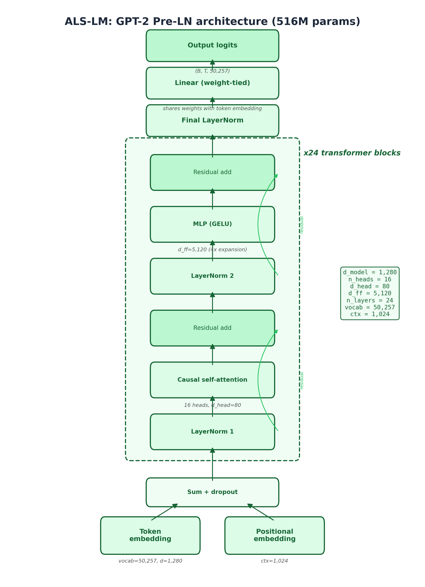
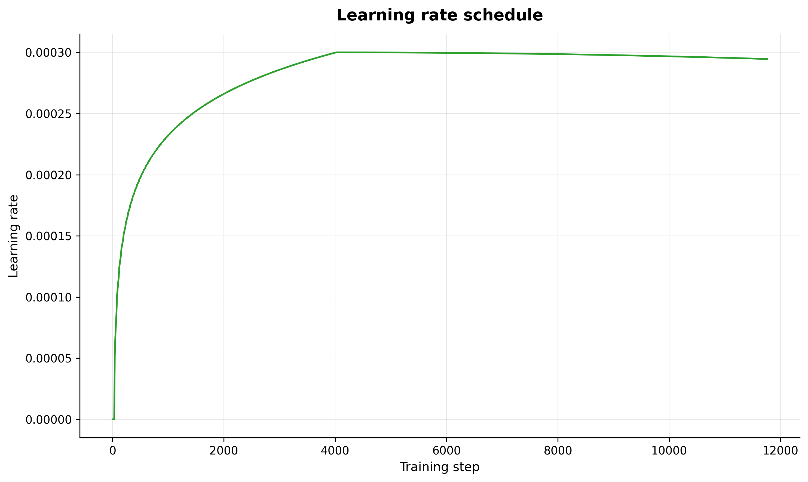
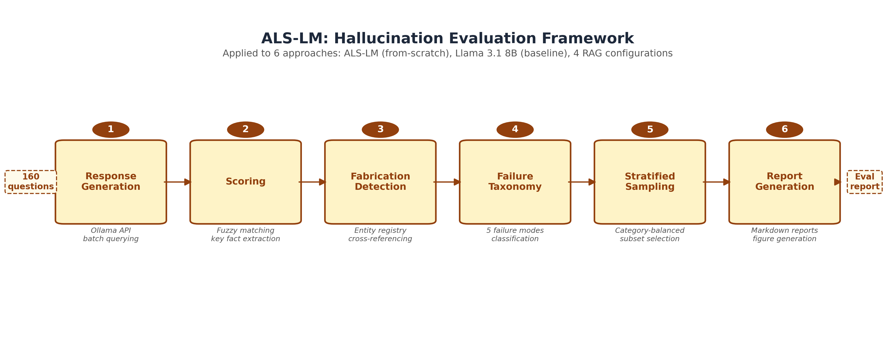
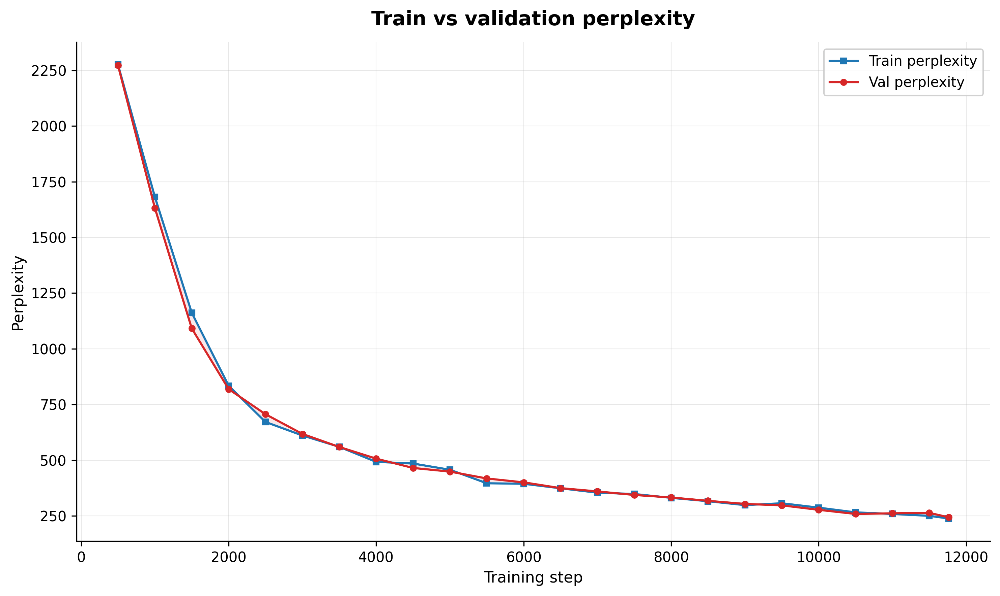
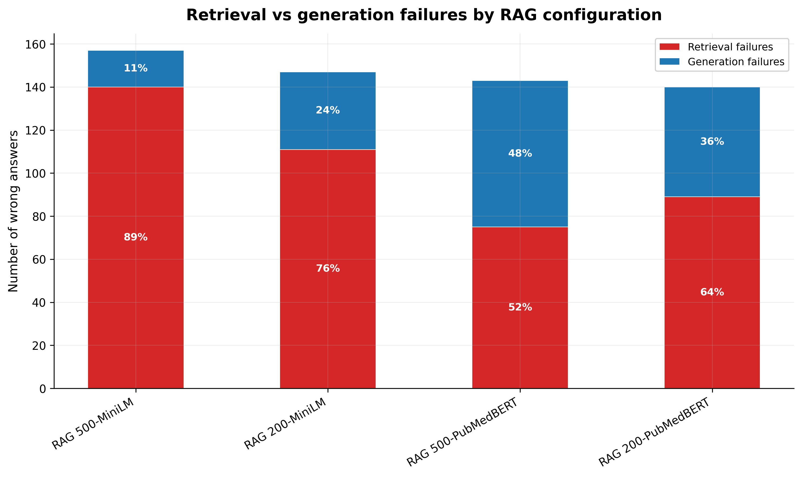
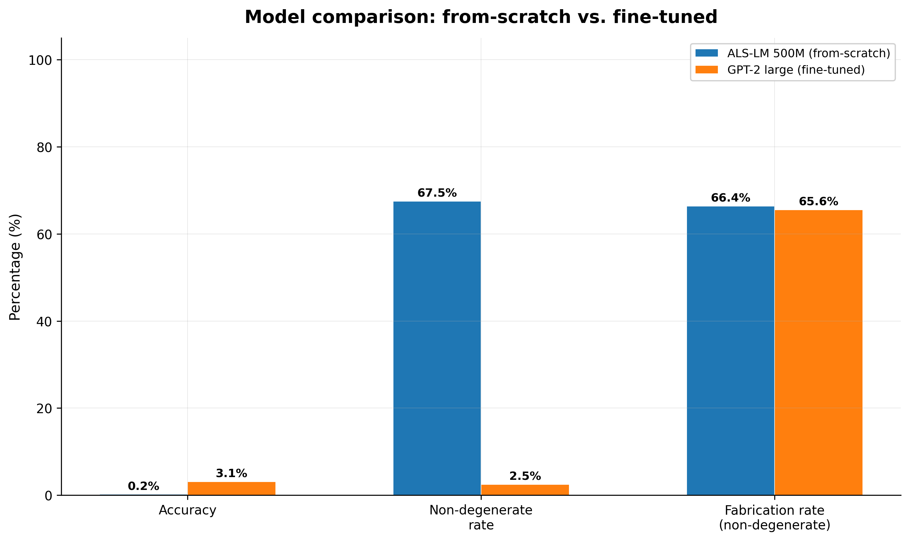

# ALS-LM: Investigating Domain-Specific Language Model Training on a Narrow Medical Corpus

**Author:** [josh-wong](https://github.com/josh-wong)
**Date:** March 6, 2026
**Status:** Approved

---

## Abstract

Domain-specific language models such as BioBERT, BioGPT, and GatorTron have demonstrated that pretraining on biomedical corpora improves downstream clinical and scientific tasks, benefiting from billions of tokens of broad biomedical literature. We investigate the opposite extreme: what can a purpose-built decoder-only transformer (516M parameters, GPT-2 architecture with Pre-LN) learn from just 143M tokens of curated amyotrophic lateral sclerosis (ALS) research? At 0.25 tokens per parameter, this represents an 80x deficit relative to the Chinchilla-optimal ratio.

We construct a reproducible pipeline spanning data collection from three public sources (19,164 documents), BPE tokenizer training with domain-specific vocabulary (50/100 top medical terms as single tokens), and model training by using DeepSpeed ZeRO Stage 2 on consumer hardware (NVIDIA RTX 3060, 12GB VRAM). Training for 3 epochs (11,760 steps, 4h 27m) achieves a Well-fit classification with validation loss 5.4956 (relative gap +0.42%), yet the model attains only 0.21% mean factual accuracy on our 160-question ALS benchmark (Q8_0 quantization, reported as the representative level in Section 5), demonstrating the gap between language-modeling competence and factual knowledge.

We further evaluate retrieval-augmented generation (RAG) by using ChromaDB with dual embedding models. Domain-specific embeddings (PubMedBERT) outperform general-purpose embeddings (MiniLM) by 2.1x on mean accuracy (12.7% vs. 5.9%), but even the best RAG configuration (13.8%) does not exceed the no-retrieval baseline (14.3%), revealing retrieval quality as the primary bottleneck. We extend the investigation with a controlled comparison: fine-tuning GPT-2 large (774M parameters) on the same ALS corpus. The fine-tuned model achieves 3.12% mean accuracy, a 15x improvement over from-scratch training, but produces degenerate (repetitive, non-responsive) output for 97.5% of questions, revealing that pretrained language competence does not translate to instruction-following capability without explicit alignment training. We contribute an end-to-end open-source pipeline, a hallucination evaluation framework with a 5-mode failure taxonomy and entity-based fabrication detection (~48K entities), and honest documentation of negative results that illuminate data requirements for domain-specific model training.

## 1. Introduction

The past five years have seen an accelerating trend toward domain-specific language models in biomedicine. BioBERT ([Lee et al., 2020](https://academic.oup.com/bioinformatics/article/36/4/1234/5566506)) demonstrated that continued pretraining of BERT on PubMed abstracts and full-text articles improves biomedical named entity recognition by 0.62 F1 points over the general-domain baseline. BioGPT ([Luo et al., 2022](https://arxiv.org/abs/2210.10341)) achieved state-of-the-art results on PubMedQA and biomedical relation extraction by using a GPT-2-style decoder trained on 15 million PubMed abstracts. GatorTron ([Yang et al., 2022](https://arxiv.org/abs/2203.03540)), at 8.9 billion parameters trained on over 90 billion words of clinical and biomedical text, pushed the boundaries of clinical natural language inference. These models share a common thread: massive training corpora spanning broad biomedical domains, ranging from billions to tens of billions of tokens.

We ask a different question. What happens when we dramatically reduce both the breadth and volume of training data, focusing on a single disease domain with a corpus orders of magnitude smaller than what these models consume? Specifically, we train a 516M-parameter decoder-only transformer from scratch on 143M tokens of curated ALS research literature. At 0.25 tokens per parameter, this places our model 80 times below the Chinchilla-optimal ratio of approximately 20 tokens per parameter ([Hoffmann et al., 2022](https://arxiv.org/abs/2203.15556)). We are not merely data-limited; we are operating in a regime where conventional scaling laws predict that the model cannot possibly acquire meaningful factual knowledge.

This is by design. Our research question is not whether a small model trained on narrow data can compete with larger systems. It cannot, and our results confirm this decisively. Instead, we investigate what such a model does learn, how it fails, and what the failure modes reveal about the relationship between training data volume, language-modeling loss, and factual accuracy. The answer turns out to be more nuanced than simple failure: our model achieves a Well-fit classification with a validation loss relative gap of just +0.42%, indicating that it has learned generalizable statistical patterns of ALS research language, yet it attains only 0.21% mean factual accuracy on a domain-specific benchmark. This disconnect between language-modeling competence and factual knowledge acquisition is itself an informative finding.

We emphasize that this project is a machine-learning research and education artifact, not a medical information tool. The model should never be used for clinical decision-making, patient education, or any application where factual accuracy matters. The hallucination evaluation framework we develop exists to quantify the model's unreliability, not to demonstrate its utility. Any outputs from the model or from the RAG comparison system should be treated as experimental results, not as medical information.

Our investigation makes four contributions:

1. **A complete, open-source pipeline from data collection to evaluation.** We provide scripts for scraping PubMed Central, ClinicalTrials.gov, and educational sources; data cleaning with MinHash deduplication; BPE tokenizer training with medical term validation; model training with DeepSpeed ZeRO on consumer hardware; GGUF export for local inference via Ollama; and automated evaluation. Every stage is scripted and reproducible with fixed random seeds and locked dependencies.
2. **A hallucination evaluation framework with a 5-mode failure taxonomy.** We design a 160-question benchmark spanning 8 ALS knowledge categories (20 questions each) with key-fact-based fuzzy matching scoring. We implement entity-based fabrication detection by using a registry of approximately 48,000 known entities (drugs, genes, proteins, institutions) and classify failures into five modes: confident fabrication, plausible blending, outdated information, boundary confusion, and accurate but misleading. This taxonomy enables structured analysis of how and why models fail, not merely that they fail.
3. **A RAG comparison revealing retrieval as the bottleneck.** We evaluate four RAG configurations by using ChromaDB with two embedding models (MiniLM and PubMedBERT) at two chunk sizes (200 and 500 tokens) against a no-retrieval Llama 3.1 8B baseline. The results demonstrate that embedding-model choice is the single most impactful variable (PubMedBERT outperforms MiniLM by 2.1x), but that even the best RAG configuration does not exceed the no-retrieval baseline, pointing to retrieval quality rather than generation capability as the primary limitation.
4. **Honest documentation of a negative result.** The machine-learning literature suffers from a well-known publication bias toward positive results. We contribute a detailed analysis of a project that achieves excellent language-modeling metrics but near-zero factual accuracy, providing an empirical data point at the extreme low end of the data-scaling curve. The dual narrative of rigorous pipeline engineering alongside transparent negative results is itself a contribution to the field's understanding of data requirements for domain-specific models.

The remainder of this paper is organized as follows. Section 2 surveys related work across domain-specific language models, hallucination evaluation, medical RAG, and data-scaling laws. Section 3 details our methodology, covering the data pipeline, tokenizer, model architecture, and training procedure. Section 4 describes our evaluation framework, including benchmark design, scoring methodology, fabrication detection, and failure taxonomy. Section 5 presents training results and hallucination evaluation findings across three quantization levels. Section 6 reports the RAG comparison experiment and failure decomposition analysis. Section 7 reports a controlled comparison between the from-scratch model and a fine-tuned GPT-2 large, revealing the impact of pretrained knowledge on ALS-specific accuracy. Section 8 discusses the implications of our findings, with particular attention to the data deficit, embedding-model impact, and the loss-accuracy gap. Section 9 concludes with a summary and directions for future work.

## 2. Related work

Our work sits at the intersection of four research threads: domain-specific language model training, hallucination evaluation, retrieval-augmented generation for medical text, and neural scaling laws. We survey each below, positioning our contributions relative to the existing literature.

### 2.1 Domain-specific language models

The dominant paradigm in biomedical NLP has been to adapt general-purpose pretrained models to the biomedical domain through continued pretraining on domain-specific corpora. BioBERT ([Lee et al., 2020](https://academic.oup.com/bioinformatics/article/36/4/1234/5566506)) pioneered this approach by continuing BERT pretraining on PubMed abstracts and PMC full-text articles (approximately 18 billion words), achieving improvements of 0.62 F1 on biomedical NER, 2.80 F1 on relation extraction, and 12.24 F1 on question answering over the general-domain BERT baseline. SciBERT ([Beltagy et al., 2019](https://aclanthology.org/D19-1371.pdf)) took a complementary approach, training a BERT-base model from scratch on 3.1 billion tokens from Semantic Scholar, finding that a custom scientific vocabulary (scivocab) improves performance on scientific information extraction tasks over the default BERT vocabulary.

The shift from encoder-only to decoder-only architectures brought BioGPT ([Luo et al., 2022](https://arxiv.org/abs/2210.10341)), a 347M-parameter GPT-2-style model trained on 15 million PubMed abstracts. BioGPT achieved state-of-the-art results on PubMedQA and biomedical relation extraction, demonstrating that generative pretraining can capture biomedical knowledge effectively. BioMedLM ([Bolton et al., 2024](https://arxiv.org/html/2403.18421v1)) scaled this approach to 2.7 billion parameters trained on PubMed abstracts and full-text articles, showing competitive performance with much larger general-domain models on medical question answering. At the largest scale, GatorTron ([Yang et al., 2022](https://arxiv.org/abs/2203.03540)) trained an 8.9-billion-parameter model on over 90 billion words combining clinical notes, PubMed articles, and Wikipedia, achieving the best results on clinical NLI benchmarks.

Table 1 summarizes the key characteristics of these models alongside ALS-LM.

**Table 1.** Domain-specific biomedical language models. ALS-LM operates at 80x below the Chinchilla-optimal data ratio, with a corpus 20-35x smaller than the nearest comparable decoder model (BioGPT). ALS-LM (fine-tuned) demonstrates that pretrained general knowledge provides modest accuracy improvement but does not resolve the instruction-following limitation.

| Model    | Parameters | Training data                      | Architecture    | Year | Key result                                       |
|----------|------------|------------------------------------|-----------------|------|--------------------------------------------------|
| BioBERT  | 110M       | PubMed abstracts + PMC (18B words) | BERT-base       | 2020 | +0.62 F1 on biomedical NER over BERT             |
| SciBERT  | 110M       | Semantic Scholar (3.1B tokens)     | BERT-base       | 2019 | Custom scivocab improves over BERT on SciIE      |
| BioGPT   | 347M       | 15M PubMed abstracts               | GPT-2 medium    | 2022 | State-of-art on PubMedQA, relation extraction    |
| GatorTron | 8.9B      | 90B+ words (82B clinical)          | BERT-like       | 2022 | Best clinical NLI on MedNLI                      |
| BioMedLM | 2.7B       | PubMed abstracts + full text       | GPT-2 style     | 2024 | Competitive with larger models on medical QA     |
| ALS-LM   | 516M       | 143M tokens (ALS only)             | GPT-2 (Pre-LN)  | 2026 | 0.21% accuracy; demonstrates data deficit impact |
| ALS-LM (fine-tuned) | 774M | 143M tokens (ALS fine-tuning) | GPT-2 large | 2026 | 3.12% accuracy; 97.5% degenerate output          |

The scale difference is immediately visible. Even BioBERT, the smallest model in the table, trained on a corpus approximately 125 times larger than ours (18 billion words vs. 143 million tokens). BioGPT, the closest architectural comparison at 347M parameters, used approximately 15 million abstracts that we estimate contain 3-5 billion tokens, placing it 20-35x above our data volume. Unlike these models, which benefit from broad biomedical coverage across many diseases and subdomains, our work deliberately investigates the data-starved regime: a single-disease corpus where the available literature is fundamentally insufficient for the model size. Our results confirm that this data deficit is the dominant factor in the model's near-zero factual accuracy, even as it achieves healthy language-modeling loss.

### 2.2 Hallucination evaluation

Evaluating factual accuracy and hallucination in language models has become an active research area as model capabilities have scaled. TruthfulQA ([Lin et al., 2022](https://arxiv.org/abs/2109.07958)) introduced a benchmark of 817 adversarial questions targeting common misconceptions, finding that larger models are often less truthful than smaller ones because they more effectively learn the statistical patterns of human misconceptions in their training data. FActScore ([Min et al., 2023](https://arxiv.org/abs/2305.14251)) took a fine-grained approach, decomposing generated biographies into atomic facts and scoring each against a reference corpus, enabling precision measurement at the individual claim level rather than the response level.

SelfCheckGPT ([Manakul et al., 2023](https://arxiv.org/abs/2303.08896)) addressed the reference-free setting by leveraging the observation that factual claims tend to be consistent across multiple stochastic samples while hallucinated claims vary, enabling hallucination detection without ground truth. In the medical domain, Med-HALT ([Umapathi et al., 2023](https://arxiv.org/abs/2307.15343)) tested large language models on reasoning and memory tasks derived from medical licensing exams, establishing structured categories of medical hallucination. MedHallu ([Chen et al., 2025](https://arxiv.org/abs/2502.14302)) extended this with a controlled hallucination generation pipeline producing 10,000 medical question-answer pairs across multiple hallucination types.

Table 2 situates our evaluation approach relative to these benchmarks.

**Table 2.** Hallucination evaluation approaches. Our benchmark is the only domain-specific evaluation combining curated questions, entity-based fabrication detection, and multi-mode failure taxonomy on a narrow medical subdomain.

| Benchmark/Tool | Approach                      | Year | Scale           | Key innovation                                       |
|----------------|-------------------------------|------|-----------------|------------------------------------------------------|
| TruthfulQA     | 817 adversarial questions     | 2022 | General domain  | Targets common misconceptions                        |
| FActScore      | Fine-grained factual scoring  | 2023 | Biography       | Per-atomic-fact precision                            |
| SelfCheckGPT   | Self-consistency checking     | 2023 | General         | No reference needed; uses stochastic sampling        |
| Med-HALT       | Medical hallucination test    | 2023 | Medical         | Reasoning + memory tests from medical exams          |
| MedHallu       | 10K medical QA pairs          | 2025 | Medical         | Controlled hallucination generation pipeline         |
| ALS-LM Eval   | 160 curated ALS questions     | 2026 | ALS-specific    | 5-mode taxonomy + entity-based fabrication detection |

Our evaluation framework differs from these approaches in three respects. First, our benchmark is domain-specific rather than general medical or general knowledge: 160 questions curated across 8 categories of ALS knowledge (clinical trials, diagnostic criteria, disease mechanisms, drug treatment, epidemiology, gene mutations, patient care, and temporal accuracy), each with expert-defined key facts for scoring. Second, we implement entity-based fabrication detection by using a registry of approximately 48,000 known entities across five categories (6,469 drugs, 20,173 genes, 8,075 proteins, 13,354 institutions, and 3 clinical trial identifiers), allowing us to flag not just incorrect answers but specifically fabricated entities that do not exist in the medical literature. Third, our 5-mode failure taxonomy (confident fabrication, plausible blending, outdated information, boundary confusion, and accurate but misleading) enables structured analysis of failure mechanisms rather than binary correct/incorrect classification. This taxonomy proved essential for understanding the qualitative differences between our from-scratch model's failures (dominated by degenerate output and repetitive loops) and the baseline model's failures (dominated by confident fabrication of plausible-sounding but incorrect medical claims).

### 2.3 RAG for medical and scientific text

Retrieval-augmented generation has emerged as a strategy for grounding language model outputs in verified external knowledge. In the biomedical domain, BioASQ ([Tsatsaronis et al., 2015](https://link.springer.com/article/10.1186/s12859-015-0564-6)) established a long-running challenge for biomedical question answering with retrieval, providing a standardized benchmark that has driven progress since 2013. More recently, MedRAG and the MIRAGE benchmark ([Xiong et al., 2024](https://arxiv.org/abs/2402.13178)) evaluated RAG across multiple medical corpora, finding that retrieval-augmented approaches can improve accuracy by up to 18% over chain-of-thought baselines, though performance varies substantially depending on corpus selection and retrieval configuration.

Our RAG comparison tests a different experimental condition from most published work. Existing RAG benchmarks typically augment models that already possess substantial parametric medical knowledge with retrieval, measuring the incremental gain from adding context. In our setup, the from-scratch ALS-LM has near-zero factual accuracy (0.21%), creating a scenario where almost all correct answers must come from retrieved context rather than parametric knowledge. We compare four RAG configurations (two embedding models at two chunk sizes) against a no-retrieval Llama 3.1 8B baseline that has strong parametric knowledge from general pretraining.

Our findings diverge from the optimistic RAG literature. Even the best RAG configuration (500-token chunks with PubMedBERT embeddings, 13.8% accuracy) does not exceed the no-retrieval baseline (14.3%). The failure decomposition reveals that retrieval failures account for 52-89% of wrong answers depending on configuration, with the embedding model as the dominant variable: PubMedBERT-based retrieval averages 12.7% accuracy compared to 5.9% for MiniLM, a 2.1x improvement. This suggests that naive chunk-based retrieval with general-purpose embeddings is insufficient for domain-specific medical question answering, and that retrieval quality, not generation capability, is the primary bottleneck in this setting.

### 2.4 Data-scaling laws

The relationship between training data volume and model performance is well-established through empirical scaling laws. [Kaplan et al., 2020](https://arxiv.org/abs/2001.08361) demonstrated that language model loss follows smooth power-law relationships with model size, dataset size, and compute budget, enabling predictions of model performance from training configuration. The Chinchilla study ([Hoffmann et al., 2022](https://arxiv.org/abs/2203.15556)) refined these findings, establishing that compute-optimal training requires approximately 20 tokens per parameter, suggesting that models and data should be scaled in roughly equal proportion.

These scaling laws provide a quantitative framework for understanding our results. ALS-LM trains at 0.25 tokens per parameter (128.5 million training tokens for a 516-million-parameter model), placing us at 80 times below the Chinchilla-optimal ratio. If the power-law relationships hold in this extreme regime, the model should achieve far worse loss than a compute-optimally trained model of the same size, and the gap between language-modeling competence and downstream task performance should widen dramatically.

In practice, we observe a more nuanced picture. The model achieves a Well-fit classification with validation loss 5.4956 and a relative gap of +0.42% between training and validation loss, suggesting that it has effectively learned the statistical distribution of its training corpus without significant overfitting. Yet factual accuracy on our benchmark is 0.21%, effectively zero. This disconnect suggests that the scaling laws governing loss may have different implications for different types of downstream capability: the model can learn to produce text that statistically resembles ALS research (low perplexity) without internalizing the factual content of that research (near-zero accuracy). Our work provides an empirical data point at the extreme low end of the data-scaling curve, complementing the large-scale studies that established these relationships.

## 3. Methodology

Our methodology spans four stages: corpus construction, tokenizer training, model architecture design, and training. We describe each stage below with concrete numbers at every decision point, since reproducibility requires not just stating what we did but explaining why we made each choice. The complete pipeline is implemented in Python with all random seeds fixed and dependencies locked, enabling third-party replication on comparable hardware.

### 3.1 Data pipeline

Figure 1 shows the end-to-end data pipeline from source collection through tokenized training files.

- **Data sources.** We collected documents from three publicly available sources: PubMed Central open-access ALS research articles, ClinicalTrials.gov ALS clinical trial records, and publicly published patient and educational narratives. We deliberately restricted the corpus to a single disease domain to investigate what a model can learn from a narrow medical literature base. This yielded 19,164 total documents across the three source categories.
- **Scraping.** We implemented source-specific scrapers that respect API rate limits: NCBI E-utilities allows 3 requests per second without an API key and 10 with a key, so we configured appropriate delays with exponential backoff retry logic for transient failures. All data comes from public, appropriately licensed sources. We excluded private medical records, HIPAA-protected data, and content from private support groups. Patient narratives are limited to content that individuals intentionally published for public audiences.
- **Cleaning.** We applied an 11-step source-aware cleaning pipeline (implemented in `data/processing/clean.py`) that handles PubMed papers differently from patient narratives and clinical trial records. The steps, applied in order, are: (1) strip residual HTML/XML markup by using BeautifulSoup, (2) strip non-content sections from scientific papers (references, acknowledgments, funding, tables, figure captions, author affiliations), (3) strip in-text citations (both numbered and author-year formats), (4) remove volatile content (URLs, emails, phone numbers, temporal qualifiers, copyright notices, calls-to-action, license text), (5) strip clinical trial status lines for trial documents, (6) re-scrub personally identifiable information from patient narratives by using Presidio (a second pass after the initial scraping-stage scrub), (7) fix encoding errors with ftfy and normalize Unicode to NFC form (we chose NFC over NFKC because NFKC destructively normalizes Greek letters, superscripts, and math symbols that appear frequently in medical text), (8) normalize whitespace while preserving paragraph structure, (9) apply an English language safety net heuristic, (10) normalize medical abbreviations to canonical forms (ALS, SOD1, TDP-43, C9orf72, and 8 other domain-specific terms), and (11) embed the document title as a header. Documents shorter than 100 words after cleaning were rejected.
- **Deduplication.** We implemented a two-level deduplication approach. At the document level, we used MinHash Locality-Sensitive Hashing (LSH) with 128 permutations and a Jaccard similarity threshold of 0.85, that uses word-level 5-gram shingles. We chose word 5-grams over character shingles because medical text shares high vocabulary overlap (many documents use the same technical terms), and word n-grams reduce false positive duplicate matches in this setting. At the paragraph level, we applied SHA-256 hashing on paragraphs of at least 50 words, removing exact-duplicate text blocks across the surviving corpus. Documents that lost all qualifying paragraphs were rejected. After the train/validation split, we ran a cross-set leakage check by using MinHash LSH with a lower Jaccard threshold of 0.7 to catch near-duplicate documents that might have been placed in both sets.
- **Source caps.** To prevent any single source type from dominating the corpus distribution, we enforced post-deduplication caps of 10% for patient narratives and 15% for Wikipedia-sourced content.
- **Train/validation split.** We split the cleaned, deduplicated corpus into training and validation sets by using a 90/10 ratio, stratified by source category, with a fixed random seed of 42. This stratification ensures that both sets contain proportional representation from PubMed Central, ClinicalTrials.gov, and educational sources.
- **Final corpus size.** The tokenized corpus contains 142,939,320 total tokens: 128,495,047 training tokens and 14,444,273 validation tokens. At 516M model parameters, this yields 0.25 tokens per parameter, placing us 80 times below the Chinchilla-optimal ratio of approximately 20 tokens per parameter ([Hoffmann et al., 2022](https://arxiv.org/abs/2203.15556)).

### 3.2 Tokenizer

We trained a byte-level BPE tokenizer on the cleaned ALS corpus by using the Hugging Face `tokenizers` library. We chose BPE over WordPiece or Unigram because BPE's greedy merge strategy tends to create whole-word tokens for frequent domain terms, which is exactly the behavior we wanted for medical vocabulary.

- **Vocabulary size.** We set the vocabulary size to 50,257, matching GPT-2's vocabulary size. We chose this value for compatibility with the GPT-2 architecture and to avoid introducing an additional variable when comparing our model's behavior to GPT-2 baselines. The tokenizer uses a single special token (`<|endoftext|>`) for document boundaries.
- **Pre-processing.** Input text is normalized to NFC Unicode form before tokenization (consistent with the cleaning pipeline), and we use a byte-level pre-tokenizer that splits on whitespace boundaries while preserving the ability to encode any Unicode character as a sequence of byte tokens.
- **Medical term coverage.** We validated the tokenizer's domain coverage by checking the top 100 ALS-specific medical terms. Of these, 50 are tokenized as single tokens (e.g., "riluzole", "fasciculations", "edaravone"), meaning the model can process these terms without fragmentation. The remaining terms are split into 2-3 subword units, which is typical for longer compound terms. We compared our domain-trained tokenizer against GPT-2's general-purpose tokenizer (via tiktoken) and confirmed that the ALS tokenizer produces fewer fragments on domain-specific terminology, as documented in the tokenizer comparison report (`reports/comparison_report.md`).
- **Output format.** The tokenizer encodes the train/validation split into nanoGPT-compatible uint16 binary files (`train.bin` and `val.bin`) with an accompanying `meta.pkl` metadata file containing the vocabulary size. This format enables memory-mapped data loading during training, allowing random batch sampling without loading the entire corpus into memory.

### 3.3 Model architecture

We use a GPT-2-style decoder-only transformer with Pre-LN (layer normalization before attention and MLP sublayers, not after). Figure 2 shows the architecture.

- **Configuration.** The production model uses 24 transformer layers, 16 attention heads, an embedding dimension of 1,280, and an MLP inner dimension of 5,120 (4x expansion). The context length is 1,024 tokens. With a vocabulary size of 50,257, the total parameter count is approximately 516 million. We also maintain two smaller configurations for pipeline validation: a "tiny" model (~9M parameters: 6 layers, 6 heads, 192 embedding dimension) for rapid iteration, and a "medium" model (~111M parameters: 12 layers, 12 heads, 768 embedding dimension) matching GPT-2 Small dimensions.
- **Pre-LN.** We chose Pre-LN over the original Post-LN transformer design because Pre-LN provides more stable gradients in deeper networks, tolerates higher learning rates without divergence, and converges faster in wall-time ([Xiong et al., 2020](https://arxiv.org/abs/2002.04745)). In the Pre-LN formulation, each transformer block applies layer normalization before the attention and MLP sublayers, then adds the sublayer output as a residual: `x = x + attn(ln(x))` and `x = x + mlp(ln(x))`. A final layer norm after the last transformer block manages the slightly growing hidden state variance that Pre-LN produces across layers.
- **Weight tying.** The token embedding matrix and the language model head share the same weight tensor, following the standard GPT-2 convention ([Radford et al., 2019](https://cdn.openai.com/better-language-models/language_models_are_unsupervised_multitask_learners.pdf)). This reduces the effective parameter count and ensures that input and output token representations live in the same vector space.
- **Attention.** We use causal self-attention with learned positional embeddings (up to 1,024 positions). The implementation uses PyTorch's `F.scaled_dot_product_attention` with `is_causal=True`, which dispatches to FlashAttention on Ampere GPUs (the RTX 3060 is SM 8.6), providing O(N) memory usage and fused CUDA kernels for the attention computation.
- **Initialization.** All Linear and Embedding weights are initialized from N(0, 0.02). Residual projection layers (`c_proj` in both attention and MLP) use a scaled initialization of N(0, 0.02 / sqrt(2 * n_layer)) to prevent the residual stream variance from growing with depth, following the GPT-2 initialization scheme.

### 3.4 Training

- **Hardware.** All training runs on a single consumer-grade machine: an NVIDIA RTX 3060 with 12GB VRAM, 64GB system RAM, and an Intel i5-12400 processor, running under WSL2 on Windows. We chose to train on consumer hardware deliberately, both as a constraint that tests the feasibility of domain-specific model training outside of institutional compute clusters and as a reproducibility requirement (the hardware is widely available and affordable).
- **Memory strategy.** A 516M-parameter model in fp32 requires approximately 2GB for weights alone. With optimizer states (Adam maintains two additional copies per parameter), gradients, and activations, the total memory requirement far exceeds the 12GB VRAM available on the RTX 3060. We address this by using DeepSpeed ZeRO Stage 2 with CPU offloading ([Rajbhandari et al., 2020](https://arxiv.org/abs/1910.02054)). ZeRO Stage 2 partitions optimizer states and gradients across data-parallel ranks (in our single-GPU case, this means offloading to CPU RAM), while keeping the model parameters on GPU for fast forward and backward passes. We additionally enable gradient checkpointing, which recomputes activations during the backward pass instead of storing them, reducing GPU memory usage by approximately 30-40% at the cost of roughly 20-30% slower training. Combined with fp16 mixed-precision training, these techniques allow the 516M model to train within 12GB VRAM.
- **Hyperparameters.** We use the Adam optimizer with learning rate 3e-4, betas (0.9, 0.95), epsilon 1e-8, and weight decay 0.1. The learning rate follows a cosine annealing schedule with 500 warmup steps, decaying to zero over the full training run. We use a micro batch size of 4 with 8 gradient accumulation steps, yielding an effective batch size of 32 sequences (32,768 tokens per step at context length 1,024). Gradient clipping is applied at 1.0 to prevent training instability. Dropout is set to 0.1 on attention weights, residual connections, and embedding outputs.

Figure 3 shows the learning rate schedule over the full training run.

- **Training duration.** We train for 3 epochs over the 128.5M training tokens, which corresponds to 11,760 training steps. The complete training run took 4 hours and 27 minutes of wall-clock time. We chose 3 epochs based on monitoring the validation loss during training: the model maintains a Well-fit classification throughout, with the validation-training loss gap remaining below 1% across all checkpoints.
- **Checkpointing.** We save DeepSpeed checkpoints every 1,000 steps with a retention policy of the last 3 regular checkpoints plus the best checkpoint by validation loss. The best checkpoint additionally includes a raw `.pt` state dict export for downstream conversion to Hugging Face and GGUF formats.
- **Training results.** The model converges to a final training loss of 5.4727 and validation loss of 5.4956, representing a relative gap of +0.42%. This yields a Well-fit classification: the model has learned generalizable statistical patterns from the training corpus without significant overfitting. Training loss decreased from 11.1484 to 5.4727 over the full run, a 50.9% reduction, while validation loss tracked closely from 7.7284 to 5.4956. We observe mild validation loss divergence starting around step 11,000, suggesting that additional epochs would risk overfitting, but the magnitude is small enough that the 3-epoch training budget is appropriate for this corpus size.
- **Reproducibility.** All random seeds are fixed (seed=42), dependency versions are locked in `requirements.txt`, and the training script supports dry-run mode for configuration validation before committing GPU time. The DeepSpeed configuration, model architecture, and all hyperparameters are logged as the first entry in a structured JSONL training log for full provenance.

## 4. Evaluation framework

### 4.1 Benchmark design

We designed a 6-stage evaluation pipeline to assess the model's factual accuracy, detect fabricated entities, classify failure modes, and enable structured comparison across model variants and retrieval configurations. Figure 4 shows the complete evaluation flow.

The evaluation begins with a curated benchmark of 160 ALS-specific questions distributed across 8 knowledge categories, with 20 questions per category: clinical trials, diagnostic criteria, disease mechanisms, drug treatment, epidemiology, gene mutations, patient care, and temporal accuracy. We chose these categories to span the full breadth of ALS knowledge, from molecular biology (gene mutations, protein pathology) through clinical practice (diagnostic criteria, treatment options) to population-level data (incidence rates, risk factors).

Each question includes the question text, an expected answer, a list of independently verifiable key facts (for partial credit scoring), a category label, and a difficulty level. We manually curated all 160 questions rather than auto-generating them from the training corpus, because auto-generated questions risk testing the model's ability to memorize specific passages rather than its factual understanding. Manual curation allowed us to ensure clinical accuracy, control difficulty distribution, and include questions that require synthesis across multiple sources (e.g., "What is the relationship between TDP-43 pathology and C9orf72 repeat expansions?").

The design rationale is that binary correct/incorrect scoring obscures important distinctions between types of failure. A model that produces coherent but fabricated medical claims fails differently from one that produces repetitive gibberish, and understanding these failure modes is essential for characterizing what the model has actually learned. The 6-stage pipeline provides this granularity.

### 4.2 Scoring

The scoring stage evaluates each model response against the benchmark's key facts by using fuzzy string matching via the `rapidfuzz` library. We chose fuzzy matching over exact string matching because models rarely reproduce expected answers verbatim, even when they contain the correct information expressed in different words or word order.

- **Key fact extraction.** Each expected answer in the benchmark is decomposed into independently verifiable factual claims. For example, an expected answer about riluzole might contain three key facts: "riluzole is the first FDA-approved treatment for ALS," "it works by reducing glutamate excitotoxicity," and "it extends survival by approximately 2-3 months." This decomposition enables partial credit: a response that mentions the mechanism but not the survival benefit receives proportional credit rather than a binary pass or fail.
- **Matching methodology.** For each response, we break the text into overlapping chunks (100 characters wide, with 50-character overlap). For each key fact, we compute the `partial_ratio` score from rapidfuzz against every chunk. A key fact is considered "found" if any chunk scores at or above the threshold of 80. Per-question accuracy is the proportion of key facts found (mean accuracy), and a question-level binary pass requires at least 50% of key facts to be matched.
- **Coherence pre-filtering.** Before scoring, each response passes through a coherence pre-filter that flags degenerate output. A response is classified as incoherent (and excluded from substantive scoring) if it meets any of four conditions: it is empty or shorter than 10 characters, it contains a word repeated 6 or more times consecutively, it contains any 3-gram repeated 4 or more times (catching phrase-level repetition loops), or more than 80% of its characters are non-alphanumeric (token salad). This pre-filter is necessary because the from-scratch ALS-LM frequently produces degenerate output, and passing such output through the full scoring pipeline would waste computation and distort aggregate metrics.
- **Aggregation.** We compute per-category accuracy (mean and median across the 20 questions in each category), overall accuracy (mean across all 160 questions), and binary pass rate (percentage of questions where at least 50% of key facts were matched). We also track hedging language frequency as a qualitative signal of model confidence calibration.

### 4.3 Fabrication detection

The fabrication detection stage identifies entities in model responses that do not appear in the training corpus. Unlike reference-based hallucination detection (which checks whether claims are supported by cited sources), our approach is entity-based: we maintain a registry of known entities extracted from the training data and flag any entity in a model response that is absent from this registry. We chose this approach because our from-scratch model has no concept of citations or references, making reference-based methods inapplicable. Entity fabrication, where the model generates plausible-sounding drug names, gene symbols, or institution names that do not exist, is the primary hallucination signal in this setting.

- **Entity registry.** The registry contains approximately 48,000 known entities extracted from the training corpus across five categories: 6,469 drug names, 20,173 gene names, 8,075 protein names, 13,354 institution names, and 3 clinical trial identifiers. The registry is built by scanning the cleaned corpus for entities matching known patterns and cross-referencing against established databases.
- **Detection methodology.** We extract entity candidates from each model response by using three approaches. NCT clinical trial identifiers are extracted via regex (NCT followed by 8 digits) and checked by exact match against registry entries. Drug name candidates are extracted by identifying capitalized words and words ending with known pharmaceutical suffixes (e.g., -mab, -nib, -zole, -pril), then fuzzy-matched against the drug registry by using rapidfuzz with a threshold of 85. Gene name candidates are extracted via an uppercase-letter-and-digit pattern (2-10 characters, must contain at least one letter), then fuzzy-matched against the gene registry.
- **Fabrication rate.** We report the fabrication rate as the proportion of responses containing at least one entity not found in the registry. We note that flagged entities may include false positives: real entities that happen to be absent from our training corpus. For this reason, we designed the fabrication detection as a screening tool that identifies candidates for manual review, not as an automated ground truth classifier.

### 4.4 Failure taxonomy

The taxonomy stage classifies each response into one of five failure modes (plus two non-failure categories) by using rule-based logic that combines scoring results, fabrication flags, and text analysis. The taxonomy is designed to cover the full spectrum of model failure, from complete incoherence at one extreme to near-correct responses at the other.

- **Failure modes.** We define five failure modes, listed in classification priority order (first match wins):
- **Confident fabrication:** The response contains fabricated entities (flagged by the fabrication detection stage) asserted without hedging language. This is the most dangerous failure mode because the model presents false information with apparent confidence.
- **Outdated information:** The response references temporal facts incorrectly, particularly for questions in time-sensitive categories such as clinical trials and treatment approvals.
- **Plausible blending:** The response mixes real facts with incorrect details, producing output that is partially correct but misleadingly wrong on specific claims. This mode is detected when the response has partial key fact matches combined with fabrication flags.
- **Boundary confusion:** The response provides information from a wrong domain or related-but-incorrect medical context, typically accompanied by hedging language that suggests the model is uncertain.
- **Accurate but misleading:** The response contains factually correct information but frames it without appropriate caveats, potentially leading to incorrect conclusions.

Two additional categories handle edge cases: **accurate** (correct response, not a failure) and **degenerate** (empty or incoherent output that fails the coherence pre-filter). Degenerate responses receive low severity because, while useless, they are obviously wrong and unlikely to mislead a reader.

- **Classification logic.** The taxonomy classifier processes each response through the priority chain. If a response fails the coherence check, it is immediately classified as degenerate. Otherwise, the classifier examines fabrication results, scoring metrics, hedging language presence, and category-specific temporal indicators to assign the primary failure mode.
- **Stratified sampling.** To enable manual review without examining all 160 responses, we implement proportional stratified sampling across categories and failure modes. This selects representative responses from each stratum (the worst-scoring, best-scoring, and closest-to-threshold responses per category) for qualitative analysis, ensuring that the manual review sample reflects the full distribution of model behavior.
- **Design rationale.** The five failure modes were chosen to capture the qualitative differences we observed between the from-scratch model's failures and the baseline model's failures during development. The from-scratch ALS-LM predominantly produces degenerate output (repetitive loops, token salad) because it has not learned enough factual content to generate coherent medical claims. In contrast, the Llama 3.1 8B baseline predominantly produces confident fabrication because it has sufficient language-modeling capability to generate fluent medical text but lacks the specific domain knowledge to make it accurate. This distinction, invisible to binary accuracy metrics, is exactly what the taxonomy is designed to capture.

## 5. Results

This section presents the quantitative findings from training and evaluating ALS-LM. We begin with training convergence analysis, proceed to hallucination evaluation across three quantization levels, and conclude with a brief assessment of quantization impact. All numbers in this section are transcribed verbatim from our automated analysis reports; no values have been rounded or re-calculated.

### 5.1 Training results

Figure 5 shows the training and validation loss curves over the full 3-epoch training run.

Training ran for 3 epochs (11,760 steps) over 4 hours and 27 minutes of wall-clock time. The final training loss was 5.4727 and the final validation loss was 5.4956, yielding a relative gap of +0.42%. Our automated overfitting analysis classifies this as Well-fit: the model has learned generalizable statistical patterns from the training corpus without significant memorization.

Training loss decreased from 11.1484 to 5.4727 over the full run, a 50.9% reduction. Validation loss tracked the training loss closely throughout, falling from 7.7284 to 5.4956. Every checkpoint across all three epochs received a Well-fit classification, with the relative gap between training and validation loss remaining below 1% at all 24 validation checkpoints.

Figure 6 shows the train and validation perplexity trajectories, illustrating the perplexity gap over training.

Train perplexity decreased from 2275.25 to 238.09 while validation perplexity decreased from 2272.05 to 243.63. We observe mild validation loss divergence starting around step 11,000, where validation loss increased for two consecutive checkpoints while training loss continued to decrease. This is a classic early overfitting signal, though the magnitude is small: the final perplexity gap of 5.54 (243.63 minus 238.09) represents a 2.3% relative difference, confirming that 3 epochs is an appropriate training budget for this corpus size.

These results present a productive tension. The Well-fit classification and low relative gap (+0.42%) indicate that the model has successfully learned the statistical distribution of ALS research language. It can produce text whose token-level statistics closely match the training corpus. However, as Section 3.4 established, learning to model the distribution of medical text is not the same as internalizing the factual content of that text. To assess whether this language-modeling competence translates to factual accuracy, we turn to our hallucination evaluation framework.

### 5.2 Hallucination evaluation

We evaluated the exported ALS-LM model across three GGUF quantization levels: full precision (F16), 8-bit integer (Q8_0), and 4-bit mixed (Q4_K_M). Each configuration was evaluated against the same 160-question ALS benchmark by using identical generation parameters (temperature=0, max_tokens=512).

Table 3 summarizes the aggregate results across all three quantization levels.

**Table 3.** Hallucination evaluation results across three quantization levels. Mean accuracy uses the proportional key-fact fuzzy matching score (0-1). Binary pass rate counts questions where at least 50% of key facts were matched. Fabrication rate is the percentage of extracted entities not found in the training corpus registry.

| Model           | Mean accuracy | Binary pass | Fabrication rate | Coherent responses |
|-----------------|---------------|-------------|------------------|--------------------|
| ALS-LM (F16)    |        0.0036 |        0.0% |            65.2% |    110/160 (68.8%) |
| ALS-LM (Q8_0)   |        0.0021 |        0.0% |            66.4% |    108/160 (67.5%) |
| ALS-LM (Q4_K_M) |        0.0052 |        0.0% |            66.2% |    116/160 (72.5%) |

The results are unambiguous: across all three quantization levels, the model achieves near-zero factual accuracy with a 0.0% binary pass rate. Not a single response out of 480 total (160 questions times 3 quantization levels) passed the 50% key fact threshold. Mean accuracy ranges from 0.0021 (Q8_0) to 0.0052 (Q4_K_M), representing the occasional accidental match of a single key fact fragment rather than genuine knowledge.

The coherent response rates reveal a significant proportion of degenerate output. Across the three quantization levels, 27.5% to 32.5% of responses were classified as degenerate by the coherence pre-filter (empty, repetitive loops, or token salad). The remaining responses, while passing the coherence threshold, consisted primarily of grammatically plausible but factually empty text: phrases like "we investigated the role of the disease progression" and "the most common genetic mutations in the disease" repeated with minor variations.

Figure 7 shows the failure taxonomy distribution across the evaluated model.

The failure mode distribution for ALS-LM (using the Q8_0 results as representative, since all three levels produce equivalent patterns) reveals three dominant categories: confident fabrication at 54 responses (33.8%), degenerate output at 44 responses (27.5%), and plausible blending at 43 responses (26.9%). Outdated information accounts for 19 responses (11.9%). Boundary confusion and accurate but misleading each account for 0 responses, and no responses were classified as accurate.

Two patterns deserve emphasis. First, the model never hedges. Across 160 responses, the Q8_0 evaluation detected one hedging instance ("likely"), while the F16 and Q4_K_M evaluations detected zero. The model does not produce uncertainty markers because it has not learned to distinguish what it knows from what it does not. Second, the fabrication rate is remarkably consistent across quantization levels (65.2% to 66.4%), indicating that approximately two-thirds of all entities extracted from model responses do not appear in the training corpus registry. The model generates gene-like strings (e.g., "RNA-43-43-"), disease abbreviations from related but incorrect domains (e.g., frequent references to "AD" for Alzheimer's disease and "tau pathology" in response to ALS-specific questions), and repetitive protein binding constructs that do not correspond to real molecular biology.

This result confirms the data deficit hypothesis. The model has learned ALS-adjacent language patterns, enough to produce text that superficially resembles research writing, but has not internalized the factual relationships between entities, mechanisms, and clinical findings. The gap between the Well-fit training classification and the 0.0% binary pass rate is itself the central empirical finding of this work.

### 5.3 Quantization impact

Quantization has no meaningful impact on ALS-LM's evaluation results. Table 3 shows that mean accuracy varies between 0.0021 and 0.0052 across the three quantization levels, with all three achieving identical 0.0% binary pass rates and fabrication rates within 1.2 percentage points of each other (65.2% to 66.4%).

This null result is expected. Quantization degrades model performance by introducing rounding errors in weight representations, but these errors are only detectable when the model has a measurable signal to degrade. At near-zero accuracy, the base signal is too weak for quantization artifacts to manifest. The practical implication is that Q4_K_M (which requires approximately 4x less storage than F16) can be used for all downstream evaluation and inference with no loss of information, since there is no information to lose.

## 6. RAG comparison

The from-scratch ALS-LM demonstrates that training on a narrow corpus produces a model with near-zero factual accuracy. A natural question follows: can the same corpus be more effectively leveraged through retrieval-augmented generation, where a capable pretrained model draws on our ALS documents at inference time rather than encoding their content in its parameters? This section presents a systematic comparison of four RAG configurations against a no-retrieval baseline, revealing that retrieval quality, not generation capability, is the primary bottleneck.

### 6.1 Experimental setup

We evaluate five approaches against the same 160-question ALS benchmark used in Section 5, plus the from-scratch ALS-LM results for reference.

- **Base model.** We use Llama 3.1 8B ([Meta, 2024](https://llama.meta.com/)) served locally via Ollama for both the no-retrieval baseline and all RAG configurations. We chose Llama 3.1 8B rather than our trained ALS-LM because the RAG comparison tests a different question: whether retrieval from our ALS corpus can improve a model that already possesses general language understanding and parametric medical knowledge. By using the from-scratch ALS-LM as the RAG base model would confound two variables (retrieval benefit and base model capability), since its near-zero accuracy leaves no foundation for retrieval to augment.
- **Retrieval system.** We use ChromaDB as the vector store, indexing the same cleaned ALS corpus used for model training. We test two embedding models for chunk encoding: all-MiniLM-L6-v2 (a general-purpose sentence embedding model) and PubMedBERT (a biomedical domain-specific embedding model trained on PubMed abstracts). We test each embedding model at two chunk sizes: 200 tokens and 500 tokens. This yields four RAG configurations: 500-MiniLM, 200-MiniLM, 500-PubMedBERT, and 200-PubMedBERT.
- **No-retrieval baseline.** The same Llama 3.1 8B model answers all 160 benchmark questions from its parametric knowledge only, with no retrieved context. This isolates the contribution of retrieval from the base model's existing capabilities.
- **Evaluation.** All six approaches (ALS-LM, baseline, and four RAG configurations) are evaluated by using the identical 6-stage pipeline described in Section 4: response generation with greedy decoding, key-fact fuzzy matching, fabrication detection against the entity registry, taxonomy classification, stratified sampling, and report generation. The only difference is that RAG configurations prepend retrieved chunks to the question prompt by using a structured context injection template.

### 6.2 Baseline vs. RAG results

Figure 8 shows the accuracy comparison across all six approaches.

Table 4 presents the aggregate results.

**Table 4.** Cross-approach accuracy comparison on the 160-question ALS benchmark. ALS-LM values use Q8_0 as the representative quantization level from Section 5 (all three levels produce equivalent results). Baseline is Llama 3.1 8B without retrieval. RAG configurations use Llama 3.1 8B with ChromaDB retrieval at the specified chunk size and embedding model.

| Approach                | Mean accuracy | Binary pass | Fabrication rate |
|-------------------------|---------------|-------------|------------------|
| ALS-LM (Q8_0)           |        0.0021 |       0.0%  |            66.4% |
| Baseline (no retrieval) |        0.1432 |      13.8%  |            87.2% |
| RAG 500-MiniLM          |        0.0219 |       1.9%  |            51.4% |
| RAG 200-MiniLM          |        0.0969 |       8.1%  |            81.0% |
| RAG 500-PubMedBERT      |        0.1380 |      10.6%  |            80.3% |
| RAG 200-PubMedBERT      |        0.1151 |      12.5%  |            84.0% |

Three findings emerge from these results.

- **First, the best RAG configuration does not exceed the no-retrieval baseline.** The highest-performing RAG setup (500-PubMedBERT at 13.8% mean accuracy) falls just below the no-retrieval baseline (14.3%). This is the opposite of the typical RAG narrative, where retrieval improves over parametric knowledge alone. In our setting, retrieval introduces noise that offsets whatever relevant information it provides. The model appears to defer to retrieved context even when its parametric knowledge would produce a better answer, a phenomenon we term retrieval suppression: the presence of retrieved chunks suppresses the model's use of its own knowledge rather than augmenting it.
- **Second, embedding-model choice is the single most impactful configuration variable.** PubMedBERT-based retrieval averages 12.7% mean accuracy across the two chunk sizes ((13.8% + 11.5%) / 2), compared to 5.9% for MiniLM-based retrieval ((2.2% + 9.7%) / 2), a 2.1x improvement. This gap persists across both chunk sizes, indicating that domain-specific embeddings fundamentally retrieve more relevant content than general-purpose embeddings when the corpus consists of specialized medical text.
- **Third, the 500-MiniLM configuration demonstrates context pollution.** At 2.2% mean accuracy with 61.3% degenerate output and only 1.9% binary pass rate, 500-MiniLM performs dramatically worse than all other configurations. The combination of large chunks (500 tokens) and general-purpose embeddings retrieves long passages with low semantic relevance to the query. The model, following its instruction to use retrieved context, produces more "Not found in context" responses and degenerate output than substantive answers. This establishes that poorly matched retrieval is worse than no retrieval at all.

The per-category accuracy breakdown reveals complementary patterns across approaches. Drug treatment is the strongest category across all approaches that use Llama 3.1 8B: the baseline achieves 0.3250 mean accuracy and 500-PubMedBERT achieves 0.3125, reflecting Llama 3.1's strong parametric knowledge of common ALS medications. Epidemiology is consistently the weakest category, with the baseline at 0.0375 and the best RAG configuration (500-PubMedBERT) at only 0.0500, suggesting that epidemiological data requires more precise recall than either parametric knowledge or retrieval can provide.

### 6.3 Failure decomposition

For each wrong RAG answer, we classify the failure as either a retrieval failure (no key facts found in the retrieved chunks, meaning the retrieval system failed to surface relevant information) or a generation failure (at least one key fact present in the retrieved chunks but the model still produced an incorrect answer, meaning the model failed to use available information). This decomposition applies only to the four RAG configurations, since ALS-LM and the baseline have no retrieval component.

Figure 9 shows the retrieval versus generation failure decomposition across the four RAG configurations.

Table 5 presents the failure decomposition numbers.

**Table 5.** Failure decomposition for RAG configurations. Total wrong is the number of questions answered incorrectly. Retrieval failures indicate questions where no key facts appeared in the retrieved chunks. Generation failures indicate questions where relevant information was retrieved but the model still answered incorrectly.

| Metric                  | 500-MiniLM | 200-MiniLM | 500-PubMedBERT | 200-PubMedBERT |
|-------------------------|------------|------------|----------------|----------------|
| Total wrong             |        157 |        147 |            143 |            140 |
| Retrieval failures      |        140 |        111 |             75 |             89 |
| Generation failures     |         17 |         36 |             68 |             51 |
| Retrieval failure rate  |      89.2% |      75.5% |          52.4% |          63.6% |
| Generation failure rate |      10.8% |      24.5% |          47.6% |          36.4% |

Retrieval failures dominate across all configurations, but the magnitude varies dramatically with embedding-model choice. For 500-MiniLM, 89.2% of wrong answers are retrieval failures: the system simply cannot find relevant chunks in the corpus by using general-purpose embeddings. For 500-PubMedBERT, retrieval failures drop to 52.4%, meaning the domain-specific embeddings retrieve relevant content for roughly half the questions, but the model still fails to extract the correct answer from that content.

This shift in failure mode composition explains PubMedBERT's advantage. The domain-specific embeddings do not just retrieve more relevant content; they shift the bottleneck from retrieval to generation. With MiniLM, the primary problem is that the system cannot find relevant information. With PubMedBERT, the primary problem shifts toward the model's ability to synthesize a correct answer from retrieved context that does contain relevant information. This is a qualitatively different and arguably more tractable failure mode: improving generation from relevant context is a prompt engineering and model capability challenge, whereas improving retrieval from a fixed corpus requires better embedding models or retrieval strategies.

The per-category failure decomposition reinforces this pattern. For 500-MiniLM, retrieval failure rates reach 100.0% in disease mechanisms, epidemiology, and patient care, meaning no relevant chunks were retrieved for any question in these categories. For 500-PubMedBERT, the same categories show retrieval failure rates of 42.1%, 73.7%, and 65.0% respectively, substantial improvements that reflect PubMedBERT's ability to match medical terminology more precisely. Drug treatment shows the most dramatic improvement: retrieval failure drops from 84.2% (500-MiniLM) to 23.1% (500-PubMedBERT), indicating that PubMedBERT excels at retrieving pharmacological content from the ALS corpus.

Epidemiology remains the most retrieval-resistant category across all configurations, with failure rates of 73.7% to 100.0%. This is expected: epidemiological facts (incidence rates, risk factor statistics, geographic distributions) tend to appear as isolated numerical claims within larger documents rather than as coherent retrievable passages, making them poor candidates for chunk-based retrieval regardless of embedding-model quality.

## 7. General pretraining comparison

The from-scratch results in Section 5 raise a natural question: how much of ALS-LM's failure is attributable to insufficient data versus insufficient pretrained knowledge? A model trained from scratch on 143M tokens lacks both domain-specific factual knowledge and the general language competence that larger models acquire from broad pretraining corpora. To disentangle these factors, we conduct a controlled comparison by fine-tuning GPT-2 large (774M parameters) on the same ALS corpus, holding the training data constant while introducing pretrained general knowledge as the independent variable.

### 7.1 Methodology

We re-tokenized the ALS corpus with GPT-2's native BPE tokenizer (50,257 vocabulary size), producing 146 million training tokens and 16 million validation tokens. The GPT-2 tokenizer produces approximately 1.14x more tokens than the ALS-specific tokenizer on the same text, which is expected given that a general-purpose vocabulary fragments domain-specific terminology more frequently than a domain-trained vocabulary. We downloaded pretrained GPT-2 large weights from Hugging Face (36 transformer layers, 20 attention heads, 1,280 embedding dimension, 774M total parameters) and applied automatic Conv1D-to-Linear weight transposition for compatibility with our custom model class, verifying correctness through logit matching against the reference implementation (maximum difference 1.53e-05).

We fine-tuned for 2 epochs with a learning rate of 2e-5 using a cosine annealing schedule, micro batch size 2 with 16 gradient accumulation steps (effective batch size 32), and DeepSpeed ZeRO Stage 2 with CPU offloading on the same RTX 3060 hardware used for the from-scratch training. Training took approximately 16 hours (compared to 4.5 hours for the from-scratch model), producing validation loss improvement from 2.53 to 2.37, a 5.8% reduction over the fine-tuning run. We exported the fine-tuned model to three GGUF quantization levels (F16, Q8_0, Q4_K_M) and evaluated each against the same 160-question ALS benchmark using identical generation parameters (temperature=0, max_tokens=512). Evaluation settings include API-level parameter overrides (repeat_penalty=1.0, top_p=1.0) to neutralize Ollama Modelfile defaults, ensuring evaluation parity with the from-scratch run. Unless otherwise noted, the cross-model comparison in this section uses Q8_0 as the representative quantization level for both models to ensure a consistent basis.

### 7.2 Results

Figure 10 shows the grouped bar chart comparing the two models across three key metrics.

Table 6 presents the detailed cross-model comparison at the Q8_0 quantization level.

**Table 6.** Cross-model comparison on the 160-question ALS benchmark (Q8_0 quantization level). The fine-tuned model achieves higher accuracy but produces overwhelmingly degenerate output.

| Metric                   | ALS-LM 500M (from-scratch) | GPT-2 large (fine-tuned) |
|--------------------------|----------------------------:|-------------------------:|
| Mean accuracy            |                       0.21% |                    3.12% |
| Binary pass rate         |                       0.00% |                    1.87% |
| Non-degenerate responses |              108/160 (67.5%) |              4/160 (2.5%) |
| Hedging instances        |                            1 |                       22 |
| Entities extracted       |                          128 |                      951 |
| Fabrication rate (all)   |                       66.4% |                    77.0% |

The 15x accuracy improvement from 0.21% to 3.12% is the largest single effect observed in this work, yet it still leaves the fine-tuned model 97% below useful accuracy thresholds. This result reinforces the data deficit hypothesis: even with 774M pretrained parameters encoding general world knowledge, fine-tuning on 143M ALS tokens produces only a marginal absolute improvement. The pretrained knowledge provides a measurable advantage, but the magnitude confirms that the training data volume, not the absence of general knowledge, is the dominant bottleneck.

The most striking finding is the degenerate output dominance. The fine-tuned GPT-2 large produces degenerate (repetitive, non-responsive) output for 97.5% of evaluation questions (156 out of 160), compared to 32.5% for the from-scratch model (52 out of 160). The from-scratch model exhibits diverse failure modes: confident fabrication accounts for 33.1% of responses (53 out of 160), plausible blending for 23.8% (38 out of 160), and degenerate output for 32.5% (52 out of 160). The fine-tuned model's failures are qualitatively different, dominated almost entirely by degenerate repetition (97.5%) with only 2 instances of confident fabrication and 2 of plausible blending.

When GPT-2 large does produce coherent responses (4 out of 160), those responses are substantially more likely to contain correct information than the from-scratch model's coherent outputs. The 3.12% mean accuracy concentrates almost entirely in these 4 responses, suggesting that the pretrained model retains factual knowledge that manifests when it happens to generate coherent text rather than falling into repetitive loops.

The taxonomy comparison reveals the qualitative difference between the two models' failure patterns. The from-scratch 500M model distributes its failures across confident fabrication (53), plausible blending (38), outdated information (17), and degenerate output (52). The fine-tuned GPT-2 large concentrates almost all failures in the degenerate category (156), with only 2 confident fabrication and 2 plausible blending instances. This pattern is consistent with the instruction-following limitation discussed in Section 7.3: the fine-tuned model has retained factual knowledge from pretraining but cannot express it in response to structured evaluation prompts.

Cross-quantization evaluation across F16, Q8_0, and Q4_K_M for GPT-2 large confirms that quantization does not meaningfully affect results. Accuracy ranges from 2.34% (Q4_K_M) to 3.44% (F16), and 151 out of 160 taxonomy classifications agree across all three quantization levels. This matches the quantization null result observed for the from-scratch model in Section 5.3, further confirming that quantization artifacts are undetectable when the base accuracy signal is near zero.

### 7.3 Limitations

Three limitations constrain the interpretation of these results.

**Instruction-following limitation.** GPT-2 is a completion model trained to predict the next token in web text. Unlike instruction-tuned models that undergo RLHF or supervised fine-tuning on instruction-response pairs, GPT-2 has no mechanism for following the structured prompt format used in our evaluation. When given a question, it generates text that continues from the prompt rather than answering it, producing repetitive completions that the coherence filter classifies as degenerate. This is a property of the base architecture, not a failure of ALS fine-tuning. The 97.5% degenerate rate reflects the fundamental mismatch between a completion model and a question-answering evaluation format. The CLI keyword filter implemented for the interactive demo is a practical workaround that restricts outputs to ALS-relevant content at the application layer, but it does not address the underlying architectural limitation.

**General knowledge confound.** GPT-2 large was pretrained on WebText, a corpus of web pages that likely contains some ALS-related medical information. When the fine-tuned model produces a correct answer about riluzole or SOD1 mutations, we cannot determine whether this knowledge originates from ALS corpus fine-tuning or from WebText pretraining. Resolving this attribution question would require ablation studies evaluating the base GPT-2 large without ALS fine-tuning on the same benchmark, which are beyond the scope of this work. We acknowledge this confound and note that the accuracy improvement we measure (0.21% to 3.12%) is an upper bound on the ALS fine-tuning contribution.

**Limited coherent response pool.** With only 4 out of 160 responses classified as coherent, the qualitative comparison between models is severely constrained. Aggregate metrics such as accuracy and fabrication rate are dominated by the 97.5% degenerate majority. More extensive evaluation with diverse prompting strategies (few-shot examples, chain-of-thought formatting) might elicit coherent responses more reliably, but this would introduce prompting methodology as an additional variable that could confound the comparison between pretrained and from-scratch models.

## 8. Discussion

The preceding sections established the quantitative results: a Well-fit model with near-zero factual accuracy (Section 5), a RAG comparison where even the best configuration does not exceed a no-retrieval baseline (Section 6), and a fine-tuned GPT-2 large comparison revealing that pretrained knowledge improves accuracy 15x but does not resolve instruction-following limitations (Section 7). In this section, we move beyond reporting what happened to analyzing why it happened. Each subsection centers on a causal claim about the mechanisms driving our results, drawing on established scaling laws, embedding-model theory, and the relationship between language-modeling loss and factual knowledge.

### 8.1 Data deficit and scaling laws

The near-zero accuracy of ALS-LM is not a surprise. It is the predicted outcome of training at 0.25 tokens per parameter, 80 times below the Chinchilla-optimal ratio of approximately 20 tokens per parameter ([Hoffmann et al., 2022](https://arxiv.org/abs/2203.15556)). What makes this result informative rather than merely expected is the specificity with which it confirms, and extends, the scaling law predictions.

The Chinchilla study established that compute-optimal training requires roughly equal scaling of model size and data. At 516M parameters, our model would need approximately 10 billion training tokens to reach the compute-optimal frontier. We provided 143 million, approximately 1.4% of the optimal budget. The scaling laws predict that this deficit should manifest as substantially worse loss than a compute-optimally trained model of the same size. In practice, our final validation loss of 5.4956 corresponds to a perplexity of approximately 244, which is indeed orders of magnitude higher than what models like BioGPT achieve on biomedical text. The model has learned enough to produce text that statistically resembles ALS research, but the perplexity ceiling imposed by the data deficit means that its probability distributions over tokens remain too flat to encode the sharp, factually precise predictions that would indicate knowledge acquisition.

Contextualizing against the models surveyed in Section 2.1 (Table 1) makes the scale of the deficit concrete. BioBERT trained on approximately 18 billion words, roughly 125 times our corpus. BioGPT, the closest architectural comparison at 347M parameters, used 15 million PubMed abstracts containing an estimated 3-5 billion tokens, placing it 20-35 times above our data volume. GatorTron trained on over 90 billion words, more than 600 times our corpus size. These are not incremental differences; they span two to three orders of magnitude. Our results provide an empirical data point at the extreme low end of this spectrum, demonstrating that the power-law relationship between data and capability does not degrade gracefully. There appears to be a threshold below which factual knowledge acquisition is essentially impossible regardless of how well the model fits the training distribution, and at 80 times below the Chinchilla-optimal ratio, we are decisively below that threshold.

If we were to repeat this project, the most impactful change would be our data strategy. Rather than training from scratch on 143M tokens of ALS-specific text, we would first pretrain on a broad English corpus (OpenWebText, C4, or a Wikipedia subset, totaling 5-10 billion tokens) to establish general language competence and world knowledge, then fine-tune on the ALS corpus. This is precisely the approach that BioBERT and BioGPT followed: start with a strong general foundation, then specialize. Our work's negative results validate this strategy by demonstrating what happens when you skip the general pretraining step entirely. The model learns domain-specific language patterns (low loss, Well-fit classification) but has no general knowledge scaffold on which to organize the factual content of those patterns.

In Section 7, we report exactly this experiment: fine-tuning GPT-2 large (774M parameters) on the ALS corpus. The results partially validate the pretrain-then-fine-tune strategy—accuracy improves 15x from 0.21% to 3.12%—but reveal an orthogonal limitation. The completion-based GPT-2 architecture produces degenerate output for 97.5% of evaluation questions because it lacks the instruction-following capability needed to respond to structured prompts. This suggests that general pretraining is necessary but not sufficient; alignment training (RLHF, instruction fine-tuning) is additionally required to bridge the gap between language-modeling competence and useful question-answering behavior.

### 8.2 Embedding-model impact

The 2.1x accuracy advantage of PubMedBERT over MiniLM, as shown in Section 6.2, is the strongest individual finding from the RAG comparison. This gap persists across both chunk sizes (PubMedBERT averages 12.7% vs. MiniLM's 5.9%), indicating that the advantage is fundamental to the embedding model rather than an artifact of a particular retrieval configuration.

The mechanism behind this advantage relates to how embedding models organize semantic space. MiniLM was trained on general-purpose text and produces an embedding space where semantic similarity reflects general English usage patterns. In this space, medical terms are distributed according to their co-occurrence in general text, which means that domain-specific terminology (glutamate excitotoxicity, TDP-43 proteinopathy, C9orf72 repeat expansion) may be scattered across unrelated regions of the embedding space because these terms rarely appear together in general English corpora. When a query asks about riluzole's mechanism of action, MiniLM must bridge the semantic distance between the query's general-language framing and the corpus's technical vocabulary, a distance that frequently results in irrelevant chunk retrieval.

PubMedBERT, trained on PubMed abstracts, produces an embedding space where biomedical concepts cluster according to their medical relationships. Drug names cluster near their mechanisms of action, gene names cluster near their associated proteins and pathways, and disease terms cluster near their symptoms and diagnostic criteria. This organization means that a query about riluzole retrieves chunks discussing glutamate excitotoxicity and neuroprotection, because PubMedBERT's embedding space encodes the knowledge that these concepts are semantically proximate in the biomedical domain.

The failure decomposition data from Section 6.3 (Table 5) makes this concrete. For 500-MiniLM, 89.2% of wrong answers are retrieval failures, meaning the system simply could not find relevant chunks. For 500-PubMedBERT, retrieval failures drop to 52.4%. The remaining failures shift to the generation side: the model receives relevant chunks but fails to synthesize a correct answer. This bottleneck shift is qualitatively important because it implies that for PubMedBERT, the retrieval problem is substantially solved for roughly half the questions, and the remaining challenge is a generation problem that could potentially be addressed through better prompting, re-ranking, or model selection without changing the retrieval infrastructure.

The implication extends beyond our specific experiment. For any domain-specific RAG system operating on specialized corpora, embedding-model selection matters more than chunk size tuning. The 200-token versus 500-token difference has a modest and inconsistent effect on accuracy (sometimes favoring smaller chunks, sometimes larger), but the MiniLM-versus-PubMedBERT difference consistently produces a 2x accuracy gap. Domain-specific RAG requires domain-specific embeddings; "domain-specific" refers not only to the content in the vector store but to the model that encodes it.

### 8.3 Loss-accuracy gap

The most analytically interesting finding in this work is the disconnect between training metrics and factual accuracy. As shown in Section 5.1, ALS-LM achieved a Well-fit classification with a validation loss relative gap of just +0.42%, indicating that the model learned the statistical distribution of its training corpus without overfitting. Yet as shown in Section 5.2, the model achieved 0.21% mean factual accuracy and a 0.0% binary pass rate. This gap between language-modeling competence and factual knowledge is not a contradiction; it reveals that these are fundamentally different capabilities, and that language-modeling loss is a necessary but insufficient indicator of knowledge acquisition.

Language-modeling loss measures how well a model predicts the next token given preceding context. A low loss means that the model assigns high probability to the tokens that actually appear in the training data, given their context windows. This requires learning syntactic patterns (how medical sentences are structured), domain vocabulary distributions (which words co-occur in ALS research), and local semantic dependencies (what phrases tend to follow other phrases). A model can become excellent at all of these tasks, producing text that reads like plausible ALS research, without encoding the factual relationships that connect entities, mechanisms, and clinical outcomes across the corpus.

To illustrate: a model that has learned ALS language patterns might correctly predict that "riluzole" is likely to follow "The only FDA-approved treatment for ALS is" because this pattern appears frequently in the training data. But predicting this token sequence from context is different from encoding the retrievable fact that riluzole is FDA-approved for ALS. The former requires local pattern matching within a context window; the latter requires the model to have internalized a factual association that can be activated by a novel query phrased in different words. At 0.25 tokens per parameter, our model appears to have developed the former capability (token prediction from context, reflected in low loss) without the latter (factual knowledge retrieval, reflected in near-zero accuracy).

This finding has implications beyond ALS-LM. The common practice of using perplexity or validation loss as a proxy for model quality can be misleading, particularly for domain-specific models. A model that achieves low perplexity on a domain-specific corpus has demonstrated that it can model the surface statistics of that domain, but without factual evaluation against a knowledge benchmark, there is no evidence that it has internalized the domain's factual content. Our results suggest that factual knowledge acquisition requires substantially more data than statistical pattern learning. The model can learn how ALS research sounds well before it learns what ALS research says. Evaluation frameworks that measure only loss will miss this distinction entirely, which is why domain-specific factual benchmarks, like the one we developed, are necessary complements to standard training metrics.

### 8.4 Implications

Our results carry practical implications for three overlapping communities: practitioners building domain-specific language models, engineers deploying RAG systems for specialized domains, and researchers designing evaluation frameworks for language models.

For domain-specific model training, the central lesson is that minimum data requirements matter more than architecture quality. Our model architecture is sound: Pre-LN transformer with proper initialization, weight tying, FlashAttention, and DeepSpeed-enabled training. The training procedure is well-tuned: cosine learning rate schedule with warmup, gradient clipping, Well-fit convergence. None of these engineering decisions compensate for an 80x data deficit. Practitioners considering training a domain-specific model should first verify that their available corpus meets the approximate Chinchilla-optimal ratio for their target model size. If the data is insufficient, continued pretraining of an existing model on domain-specific data (the BioBERT/BioGPT approach) is overwhelmingly more effective than training from scratch, because the general pretraining provides the factual knowledge scaffold that our model lacks.

For RAG implementation, our results demonstrate that naive chunk-based retrieval with general-purpose embeddings is not a shortcut to domain-specific question answering. The 500-MiniLM configuration, which represents the default approach many practitioners would reach for (a popular general-purpose embedding model with moderate chunk sizes), achieved only 2.2% mean accuracy, worse than both the no-retrieval baseline and the from-scratch ALS-LM. Domain-specific embeddings are essential. PubMedBERT's 2.1x advantage over MiniLM is not a marginal improvement; it represents the difference between a system that retrieves relevant medical content and one that effectively retrieves noise. Furthermore, our finding that even the best RAG configuration does not exceed the no-retrieval baseline suggests that chunk-based retrieval alone is insufficient. Advanced techniques such as hybrid search (combining dense and sparse retrieval), query decomposition, and re-ranking may be necessary to realize the full potential of domain-specific corpora in RAG architectures.

For evaluation framework design, the loss-accuracy gap we document reinforces that language-modeling metrics (perplexity, validation loss, train-validation gap) do not predict task performance. A Well-fit classification tells us that the model has not overfit, but it says nothing about whether the model has acquired factual knowledge. Domain-specific factual benchmarks with structured scoring (key-fact decomposition rather than binary correct/incorrect), entity-based fabrication detection, and multi-mode failure taxonomies provide the granularity needed to assess what a model has actually learned. Our 160-question benchmark with 5-mode taxonomy revealed qualitative failure mode differences that binary accuracy metrics would have missed entirely: the distinction between the from-scratch model's degenerate output and the baseline's confident fabrication is invisible at the aggregate accuracy level but critically important for understanding model behavior.

We also reflect on what worked well and what we would change in this project. The evaluation framework exceeded our expectations; the 5-mode failure taxonomy proved essential for understanding qualitative differences between model behaviors, and the entity-based fabrication detection identified hallucinated entities that standard accuracy metrics would not flag. The RAG comparison design, which tested embedding model and chunk size as independent variables, cleanly isolated the dominant factor (embedding-model choice) from the secondary factor (chunk size). The rigorous pipeline engineering, from reproducible scraping through locked-seed training to automated evaluation, ensured that our negative results are trustworthy and replicable.

What we would change, given the results, is the overall approach to model training. We would begin with general pretraining on a broad English corpus to establish language competence and world knowledge, then fine-tune on the ALS corpus. We would also invest in a larger ALS corpus by including the full PubMed ALS literature rather than restricting to open-access articles. For the RAG comparison, we would include PubMedBERT embeddings from the outset (we tested MiniLM first, which required a second round of corpus indexing) and evaluate advanced retrieval strategies beyond naive chunking.

We acknowledge several limitations of this work. Our investigation covers a single medical domain (ALS), a single model size (516M parameters), a single RAG architecture (naive chunk-based retrieval with ChromaDB), and consumer hardware constraints that limited both corpus size and training duration. The 160-question benchmark, while carefully curated, is small relative to benchmarks like TruthfulQA (817 questions) or MedHallu (10,000 pairs). Our fabrication detection relies on a finite entity registry and will miss fabricated entities that happen to match real but unregistered names. The failure taxonomy, while more granular than binary accuracy, is still rule-based and may misclassify edge cases. We present these results as informative data points in the scaling law and domain-specific model literature, not as definitive thresholds.

## 9. Conclusion

### 9.1 Summary

We set out to investigate what a purpose-built decoder-only transformer can learn from a narrow medical corpus, and the answer is both more and less than expected. The model learned the statistical structure of ALS research language (achieving Well-fit convergence with +0.42% validation gap) but acquired effectively zero factual knowledge (0.21% mean accuracy, 0.0% binary pass rate). This disconnect is not a failure of engineering; it is a quantitative demonstration that language-modeling competence and factual knowledge acquisition are distinct capabilities with different data requirements, and that 143M tokens is sufficient for the former but not for the latter in a 516M-parameter model.

This work makes a dual contribution. First, we provide a complete, reproducible, open-source pipeline for domain-specific language model training, evaluation, and RAG comparison. The pipeline spans data collection from three public sources (19,164 documents), an 11-step source-aware cleaning process with MinHash deduplication, BPE tokenizer training with medical term validation (50 of 100 top ALS terms as single tokens), model training with DeepSpeed ZeRO Stage 2 on consumer hardware (RTX 3060, 12GB VRAM), GGUF export for local inference via Ollama, a 160-question hallucination evaluation benchmark with 5-mode failure taxonomy and entity-based fabrication detection (~48K entities), and a RAG comparison framework testing embedding model and chunk size as independent variables. Every stage is scripted with fixed random seeds and locked dependencies.

Second, we provide honest documentation of negative results that are themselves informative. The near-zero factual accuracy confirms that training at 80x below the Chinchilla-optimal ratio produces a model that cannot acquire factual knowledge, an empirical data point at the extreme low end of the scaling curve. The RAG comparison reveals that naive chunk-based retrieval with general-purpose embeddings does not exceed a no-retrieval baseline, and that embedding-model selection (PubMedBERT outperforming MiniLM by 2.1x) is the dominant variable in retrieval quality. The loss-accuracy gap demonstrates that evaluation by training loss alone is insufficient for assessing knowledge acquisition, motivating domain-specific factual benchmarks as a necessary complement to standard training metrics.

The v0.8.0 extension demonstrates that fine-tuning a pretrained model (GPT-2 large, 774M parameters) on the ALS corpus produces a 15x accuracy improvement over from-scratch training (3.12% vs. 0.21%), confirming that pretrained knowledge provides a meaningful advantage. However, the fine-tuned model produces degenerate output for 97.5% of evaluation questions, revealing that the completion-based GPT-2 architecture lacks the instruction-following capability to function as a question-answering system. This orthogonal finding adds a second dimension to the data deficit hypothesis: domain-specific models require not only sufficient training data but also an architecture or training procedure that enables structured interaction.

Our key findings can be summarized as follows. Training at 0.25 tokens per parameter (80x below Chinchilla-optimal) is insufficient for factual knowledge acquisition in a 516M-parameter model, even when the model achieves Well-fit convergence. Language-modeling loss does not predict factual accuracy; a model can learn how a domain sounds without learning what it says. Fine-tuning a pretrained model improves accuracy 15x (0.21% to 3.12%) but does not resolve the instruction-following limitation inherent in completion-based architectures. Domain-specific embeddings are essential for medical RAG, with PubMedBERT outperforming MiniLM by 2.1x across all tested configurations. The evaluation framework we developed, combining a 160-question curated benchmark, key-fact fuzzy matching, entity-based fabrication detection, and a 5-mode failure taxonomy, is reusable for other domain-specific model evaluations.

### 9.2 Future work

Several directions follow naturally from our findings.

- **Instruction tuning.** Our v0.8.0 fine-tuning experiment confirmed that general pretraining improves factual accuracy (Section 7), but the GPT-2 architecture's lack of instruction-following capability limits practical utility. The natural next step would be supervised fine-tuning (SFT) or reinforcement learning from human feedback (RLHF) on instruction-response pairs, either applied to the fine-tuned GPT-2 large or to a more modern instruction-capable base model. This would test whether alignment training can convert the modest accuracy gains into usable question-answering behavior.
- **Advanced RAG architectures.** Our RAG comparison evaluated naive chunk-based retrieval, which represents the simplest implementation approach. More sophisticated techniques including hybrid search (combining dense and sparse retrieval), query decomposition (breaking complex questions into retrieval-friendly sub-queries), re-ranking (scoring retrieved chunks with a cross-encoder before passing to the generator), and iterative retrieval (multiple retrieval rounds guided by initial generation) could substantially improve upon our baseline results. Our naive implementation establishes the performance floor that these techniques would need to exceed.
- **Scale investigation.** Our corpus was deliberately restricted to open-access ALS literature. The full PubMed ALS literature, including subscription-access articles, would provide a substantially larger corpus. Combined with a larger model and multi-GPU training, this would allow investigation of where on the scaling curve factual knowledge acquisition begins for a narrow medical domain.
- **Cross-domain evaluation.** Applying the same pipeline and evaluation framework to other narrow medical domains, such as multiple sclerosis, Parkinson's disease, or rare genetic disorders, would test whether the data-deficit thresholds we observe are ALS-specific or generalizable across medical subdomains. Each domain has different literature volumes and terminology patterns, which would provide natural variation for studying scaling behavior.
- **Evaluation refinement.** Our current evaluation is fully automated. Adding human evaluation of model outputs by domain experts (neurologists, ALS researchers) would validate the automated scoring pipeline and potentially identify failure modes that rule-based taxonomy classification misses. Expert review of the fabrication detection results would also establish false positive rates for the entity registry approach.

We emphasize again that this project is a machine-learning research and education investigation, not a medical tool. The model, the RAG system, and all evaluation outputs are research artifacts. They should never be used for clinical decision-making, patient education, or any application where factual accuracy matters. The value of this work lies not in what the model can do, but in what its failures reveal about the data requirements, evaluation challenges, and architectural decisions involved in building domain-specific language models.

## References

The following references are cited in this paper. Each entry includes a hyperlink to the primary publication or preprint.

- [Beltagy et al., 2019](https://aclanthology.org/D19-1371.pdf) – "SciBERT: A Pretrained Language Model for Scientific Text." EMNLP 2019.
- [Bolton et al., 2024](https://arxiv.org/html/2403.18421v1) – "BioMedLM: A 2.7B Parameter Language Model Trained On Biomedical Text." arXiv 2024.
- [Chen et al., 2025](https://arxiv.org/abs/2502.14302) – "MedHallu: A Comprehensive Benchmark for Detecting LLM Hallucinations in Medical Contexts." arXiv 2025.
- [Hoffmann et al., 2022](https://arxiv.org/abs/2203.15556) – "Training Compute-Optimal Large Language Models." NeurIPS 2022.
- [Kaplan et al., 2020](https://arxiv.org/abs/2001.08361) – "Scaling Laws for Neural Language Models." arXiv 2020.
- [Lee et al., 2020](https://academic.oup.com/bioinformatics/article/36/4/1234/5566506) – "BioBERT: A Pre-trained Biomedical Language Representation Model for Biomedical Text Mining." Bioinformatics, 36(4), 2020.
- [Lin et al., 2022](https://arxiv.org/abs/2109.07958) – "TruthfulQA: Measuring How Models Mimic Human Falsehoods." ACL 2022.
- [Luo et al., 2022](https://arxiv.org/abs/2210.10341) – "BioGPT: Generative Pre-trained Transformer for Biomedical Text Generation and Mining." Briefings in Bioinformatics, 2022.
- [Manakul et al., 2023](https://arxiv.org/abs/2303.08896) – "SelfCheckGPT: Zero-Resource Black-Box Hallucination Detection for Generative Large Language Models." EMNLP 2023.
- [Meta, 2024](https://llama.meta.com/) – "Llama 3.1 Model Card." Meta AI, 2024.
- [Min et al., 2023](https://arxiv.org/abs/2305.14251) – "FActScore: Fine-grained Atomic Evaluation of Factual Precision in Long Form Text Generation." EMNLP 2023.
- [Radford et al., 2019](https://cdn.openai.com/better-language-models/language_models_are_unsupervised_multitask_learners.pdf) – "Language Models are Unsupervised Multitask Learners." OpenAI Technical Report, 2019.
- [Rajbhandari et al., 2020](https://arxiv.org/abs/1910.02054) – "ZeRO: Memory Optimizations Toward Training Trillion Parameter Models." SC 2020.
- [Tsatsaronis et al., 2015](https://link.springer.com/article/10.1186/s12859-015-0564-6) – "An Overview of the BioASQ Large-Scale Biomedical Semantic Indexing and Question Answering Competition." BMC Bioinformatics, 2015.
- [Umapathi et al., 2023](https://arxiv.org/abs/2307.15343) – "Med-HALT: Medical Domain Hallucination Test for Large Language Models." CoNLL 2023.
- [Xiong et al., 2020](https://arxiv.org/abs/2002.04745) – "On Layer Normalization in the Transformer Architecture." ICML 2020.
- [Xiong et al., 2024](https://arxiv.org/abs/2402.13178) – "Benchmarking Large Language Models in Retrieval-Augmented Generation." ACL Findings 2024.
- [Yang et al., 2022](https://arxiv.org/abs/2203.03540) – "GatorTron: A Large Language Model for Electronic Health Records." Nature NPJ Digital Medicine, 2022.
