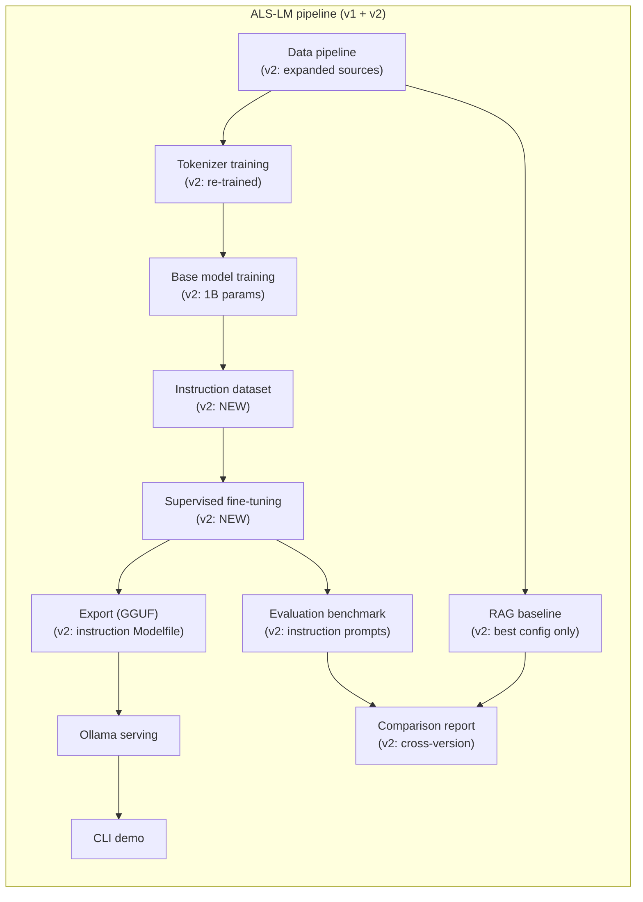
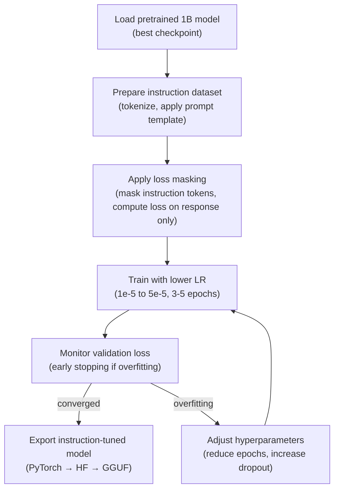

# ALS-LM 2: Design document

**Author:** [josh-wong](https://github.com/josh-wong)
**Date:** March 2026
**Status:** Approved

---

This document specifies the technical architecture and implementation approach for ALS-LM 2, covering corpus expansion, 1B model training, instruction dataset creation, supervised fine-tuning, and updated evaluation. It is a delta specification that builds on the [v1 design doc](v1-design-doc.md), describing only what changes for v2 and referencing v1 for unchanged systems. This document should be read alongside the [ALS-LM-2 white paper](v2-white-paper.md) (research vision and hypotheses) and the [ALS-LM-2 product requirements document](v2-product-requirements-doc.md) (scope and success criteria).

## 1. Overview

This section provides the updated system context, hardware constraints, and a summary of v1.0.0 technical findings that inform v2 design choices.

### 1.1 System context

The following diagram shows the complete ALS-LM pipeline spanning both v1 and v2. Nodes added or modified for v2 are annotated.



The key structural change from v1 is the two-phase training flow: base model training produces the pretrained 1B model, which is then refined through supervised fine-tuning on the instruction dataset before export and evaluation. The instruction dataset and SFT stages are entirely new components.

### 1.2 Hardware constraints

All development and training continues to run on the same consumer-grade machine used for ALS-LM-1. No new hardware dependencies are introduced for v2.

| Component | Spec                                 | Implication                                                                                                    |
|-----------|--------------------------------------|----------------------------------------------------------------------------------------------------------------|
| GPU       | NVIDIA RTX 3060, 12GB VRAM           | Primary bottleneck. 1B model requires gradient checkpointing and CPU offloading to fit.                        |
| RAM       | 64GB DDR4                            | Key asset for DeepSpeed CPU offloading. Accommodates 1B optimizer states and gradients offloaded from GPU.     |
| CPU       | Intel i5-12400 (6 cores, 12 threads) | Adequate for data processing and CPU-offloaded optimizer steps. Not a training bottleneck.                     |
| OS        | Windows 11 + WSL2 (Ubuntu)           | Training runs in WSL2 for Linux tool compatibility. GPU passthrough supported natively.                        |
| Storage   | SSD                                  | Important for data loading speed during training. Minimum 50GB free recommended for 1B checkpoints.            |

Gradient checkpointing is now mandatory for the 1B configuration. The 500M model ran without gradient checkpointing (6.37 GB peak VRAM, 53% utilization), but the 1B model's larger activation footprint requires trading compute for memory by recomputing activations during the backward pass.

### 1.3 v1.0.0 technical findings

This section consolidates the key lessons from ALS-LM-1 development that directly affect v2 design choices. Each lesson is referenced inline throughout this document where it constrains a specific v2 decision.

**Data pipeline findings:**

- Text normalization produced punctuation artifacts and whitespace inconsistencies from PDF extraction that reduced the effective information density of training tokens. The v2 cleaning pipeline addresses these specific issues (Section 2.2).
- NFC Unicode normalization (over NFKC) was validated as the correct choice for medical text, preserving Greek letters, superscripts, and math symbols. This decision carries forward unchanged.
- Source caps applied post-deduplication (not pre-dedup) prevented dedup from skewing category proportions. This pattern continues in v2.

**Tokenizer findings:**

- The tokenizer vocabulary auto-escalated from 16K to 50,257 tokens when the initial size achieved less than 50% single-token rate for medical terms. The 50,257 vocabulary size is retained for v2 because it provides adequate medical term coverage while maintaining toolchain compatibility with the GPT-2 token count.
- Custom BPE outperformed pretrained tokenizers on medical terminology: 50 of the top 100 medical terms encoded as single tokens versus 3-4 token fragmentation with GPT-2's tokenizer.

**Training findings:**

- `shutil.move` is required for checkpoint saves on WSL2 because `os.rename` fails across filesystem boundaries. The 1B training procedure inherits this pattern.
- Atomic checkpoint saves using a temporary directory plus rename prevented corruption during the 4-hour training run. This pattern continues for the longer 1B run.
- CPU offload ON with gradient checkpointing OFF yielded the best VRAM safety margin (53% utilization) for 500M. For 1B, gradient checkpointing must be ON, shifting the tradeoff toward lower throughput but adequate VRAM headroom.
- Pre-flight validation (500 steps with forced resume) caught configuration issues before committing to multi-hour production runs. This gate is even more important for the 1B run, which may take 70-140 hours.
- Cosine LR decay to zero (cos_min_ratio=0.0) produced smooth convergence without learning plateau artifacts.

**Export and evaluation findings:**

- The GGUF export pipeline (PyTorch to Hugging Face to GGUF via llama.cpp) works reliably for GPT-2 style architectures. No changes needed for 1B.
- Runtime hash patching for llama.cpp is fragile but functional. The GPT-2 native tokenizer detection bypass (added in v0.8.0) reduces reliance on this workaround.
- Q8_0 is the standardized quantization level for all cross-document metrics, established as the representative level across README, research paper, model card, and white paper.
- Greedy decoding (temperature=0) ensures reproducible evaluation outputs across runs.
- Eval-parity API overrides (repeat_penalty=1.0, top_p=1.0) neutralize Modelfile settings for fair cross-model comparison. This approach extends to the instruction-tuned model.

## 2. Data pipeline

The data pipeline is updated to expand the corpus and improve cleaning quality. The core architecture (scrapers writing standardized JSON to `data/raw/`, processing pipeline producing clean corpus) is unchanged from [v1, Section 2](v1-design-doc.md#2-data-pipeline).

### 2.1 Corpus expansion sources

The v1 corpus drew from three source categories: PubMed Central, ClinicalTrials.gov, and educational/institutional content. The v2 corpus retains these existing sources and adds new categories to increase coverage and knowledge density.

New source categories for v2 include the following.

- **Broader PubMed coverage:** Expanded search queries to capture ALS-related papers not matched by v1's MeSH-focused queries. This includes papers on motor neuron biology, neuroinflammation in ALS, biomarker development, and comorbidity studies that reference ALS as a secondary topic. The existing PubMed scraper design ([v1, Section 2.2.1](v1-design-doc.md#221-pubmed-central-primary-source)) is reused with updated query parameters.
- **WHO and international guidelines:** Clinical practice guidelines and systematic reviews from the World Health Organization, European Network for the Cure of ALS (ENCALS), and national ALS associations outside the US. These sources provide structured factual content with high knowledge density, particularly for treatment protocols and diagnostic criteria.
- **Clinical practice guidelines:** Published treatment guidelines from medical professional bodies (American Academy of Neurology, European Academy of Neurology) covering ALS diagnosis, management, and emerging therapies. These are publicly available documents with well-structured factual claims.

> **v1 lesson:** Source caps applied post-deduplication prevented dedup from skewing category proportions ([Section 1.3](#13-v100-technical-findings)). The same approach applies to new v2 source categories.

### 2.2 Cleaning improvements

The v1 processing pipeline's 11-step cleaning process ([v1, Section 2.3](v1-design-doc.md#23-processing-pipeline)) is retained with targeted fixes for artifacts identified during v1 development.

The following changes are made to the cleaning pipeline.

- **Punctuation artifact repair:** Fix systematic issues from PDF extraction where hyphens, en-dashes, and em-dashes are conflated, quotation marks are inconsistently encoded, and ligatures (fi, fl) are not decomposed. A dedicated normalization step runs before the existing encoding normalization (step 7 in the v1 pipeline).
- **Whitespace consistency:** Address cases where PDF column extraction produces mid-word line breaks and irregular spacing between sentences. The fix extends the existing whitespace normalization step (step 8) with pattern-based repair for common PDF extraction artifacts.
- **Improved paragraph boundary detection:** Better heuristics for distinguishing paragraph breaks from column breaks in multi-column PDF layouts, reducing cases where unrelated text is concatenated.

> **v1 lesson:** NFC Unicode normalization preserves Greek letters, superscripts, and math symbols important in medical literature ([Section 1.3](#13-v100-technical-findings)). The new punctuation repair step operates before NFC normalization to avoid interfering with this validated choice.

### 2.3 Updated corpus size targets

The v1 corpus yielded 143M tokens from approximately 32MB of clean text. The v2 corpus targets 300-500M tokens to improve the tokens-per-parameter ratio for the 1B model.

| Metric                    | v1 (actual) | v2 (target)     | Rationale                                                |
|---------------------------|-------------|-----------------|----------------------------------------------------------|
| Clean corpus size         | ~32MB       | ~80-150MB       | 2-5x expansion from new sources and broader queries      |
| Token count               | 143M        | 300-500M        | Moves tokens-per-parameter ratio from 0.25 to 0.3-0.5   |
| Tokens per parameter      | 0.25        | 0.3-0.5         | Still below Chinchilla-optimal (~20) but meaningfully improved |
| Source categories          | 3           | 5-6             | Adds WHO/guidelines, broader PubMed, supplementary       |

Even at 500M tokens for a 1B model (0.5 tokens per parameter), the ratio remains far below the Chinchilla-optimal ~20 tokens per parameter. The investigation explicitly acknowledges this deficit as part of the research question: how much factual knowledge can a model acquire in the data-starved regime?

## 3. Tokenizer

The tokenizer is re-trained on the expanded and cleaned corpus using the same Hugging Face `tokenizers` library and BPE algorithm described in the [v1 design doc, Section 3](v1-design-doc.md#3-tokenizer). The vocabulary size remains 50,257 tokens.

> **v1 lesson:** The tokenizer vocabulary escalated from 16K to 50,257 during v1 development when the initial size achieved less than 50% single-token rate for medical terms. The 50,257 size was validated by medical term coverage testing ([Section 1.3](#13-v100-technical-findings)).

**What changes for v2:**

- The training corpus is larger, reflecting the expanded sources from Section 2. This may shift the token distribution, particularly for terminology from newly added source categories (clinical guidelines, WHO resources).
- The cleaning improvements from Section 2.2 may affect tokenization by reducing noise tokens from PDF artifacts.
- An updated validation run against the same approximately 200 medical term list confirms that vocabulary coverage remains adequate after re-training on the expanded corpus.

## 4. Model architecture

This section specifies the 1B model configuration and memory budget, extending [v1 Section 4](v1-design-doc.md#4-model-architecture). The base architecture (decoder-only transformer, GPT-2 style, pre-norm, weight tying, GELU activation, learned positional embeddings) is unchanged.

### 4.1 1B configuration

The v1 design doc listed n_layer=32, n_head=16, n_embd=2048 as the "1B" configuration, but this actually produces approximately 1.72B parameters due to the quadratic scaling of the dominant terms (attention and MLP projections scale with n_embd squared). The corrected 1B configuration below was derived by systematic search for GPT-2 style architectures landing near 1B parameters with clean dimensions.

Changes from the [500M configuration](../configs/500m.json):

| Parameter                    | 500M (v1)  | 1B (v2)    | Rationale                                                    |
|------------------------------|------------|------------|--------------------------------------------------------------|
| n_layer                      | 24         | 30         | 1.25x depth increase for balanced scaling                    |
| n_head                       | 16         | 20         | Maintains head_dim=80, matching v1 for Flash Attention       |
| n_embd                       | 1280       | 1600       | 1.25x width increase for balanced scaling                    |
| block_size                   | 1024       | 1024       | Unchanged: adequate for training document lengths            |
| vocab_size                   | 50257      | 50257      | Unchanged: same tokenizer vocabulary                         |
| dropout                      | 0.0        | 0.1        | Enabled for 1B to mitigate overfitting on small corpus       |
| use_gradient_checkpointing   | false      | true       | Required to fit 1B in 12GB VRAM                              |

**Parameter count verification:**

The GPT-2 style parameter count formula (with weight tying) produces the following results.

```python
def calc_params(vocab_size, block_size, n_layer, n_head, n_embd):
    token_emb = vocab_size * n_embd
    pos_emb = block_size * n_embd
    attn = 4 * n_embd * n_embd + 4 * n_embd
    mlp = 8 * n_embd * n_embd + 5 * n_embd
    ln = 4 * n_embd
    block = attn + mlp + ln
    final_ln = 2 * n_embd
    return token_emb + pos_emb + n_layer * block + final_ln

# v1 500M config (actual: 538M)
calc_params(50257, 1024, 24, 16, 1280)  # = 537,900,800

# v2 1B config (actual: ~1.004B)
calc_params(50257, 1024, 30, 20, 1600)  # = 1,004,279,200
```

The recommended configuration (n_layer=30, n_head=20, n_embd=1600) provides balanced depth and width scaling from 500M (1.25x each dimension), maintains head_dim=80 matching the 500M config exactly (important for Flash Attention efficiency), and lands precisely at approximately 1.004B parameters.

Alternative configurations considered during research:

| Config       | n_layer | n_head | n_embd | head_dim | Parameters |
|--------------|---------|--------|--------|----------|------------|
| Recommended  | 30      | 20     | 1600   | 80       | 1,004.3M   |
| Alternative A | 32     | 16     | 1536   | 96       | 985.4M     |
| Alternative B | 24     | 16     | 1792   | 112      | 1,017.3M   |
| 500M (v1)    | 24      | 16     | 1280   | 80       | 537.9M     |

### 4.2 Memory budget

Resource estimates are derived from DeepSpeed memory formulas and calibrated against v1 actual measurements. The v1 500M model provides ground-truth calibration data for projecting 1B requirements.

| Component                        | 500M (v1 actual) | 1B (projected)   | Notes                                              |
|----------------------------------|------------------|-------------------|----------------------------------------------------|
| Model weights (fp16)             | ~1.0 GB          | ~1.9 GB           | Scales linearly with parameter count               |
| Activations (with grad ckpt)     | ~3-4 GB          | ~3-4 GB           | Roughly independent of depth with grad checkpointing |
| GPU peak total                   | 6.37 GB          | ~5-8 GB           | v1 actual vs v2 projected range                    |
| CPU optimizer states (Adam fp32) | included in CPU   | ~7.5 GB           | 4 bytes x 2 states x 1B params                    |
| CPU gradients (fp16)             | included in CPU   | ~1.9 GB           | 2 bytes x 1B params                               |
| CPU total                        | 30.3 GB          | ~15-20 GB         | Well within 64GB system RAM                        |

The 500M model ran without gradient checkpointing and achieved 6.37 GB peak VRAM (53% utilization of 12GB). The 1B model requires gradient checkpointing, which reduces activation memory at the cost of approximately 30% throughput. With gradient checkpointing enabled, activation memory is roughly independent of model depth because only one layer's activations are stored at a time.

> **v1 lesson:** CPU offload ON with gradient checkpointing OFF yielded 53% VRAM utilization for 500M ([Section 1.3](#13-v100-technical-findings)). For 1B, gradient checkpointing must be ON, and the readiness gate benchmark will confirm actual VRAM usage before committing to the full training run.

## 5. Training

This section specifies the changes to the training configuration for the 1B model, extending [v1 Section 5](v1-design-doc.md#5-training). The training loop, monitoring, and checkpointing strategies are unchanged from v1.

### 5.1 DeepSpeed configuration changes

The base DeepSpeed configuration ([config/ds_zero2.json](../config/ds_zero2.json)) remains unchanged. The following fields change in the per-model configuration file (the new `configs/1b.json`):

| Field                              | 500M (v1)                        | 1B (v2)                         | Rationale                                          |
|------------------------------------|----------------------------------|---------------------------------|----------------------------------------------------|
| `model.use_gradient_checkpointing` | false                            | true                            | Required to fit 1B in 12GB VRAM                    |
| `model.n_layer`                    | 24                               | 30                              | 1B architecture (Section 4.1)                      |
| `model.n_head`                     | 16                               | 20                              | 1B architecture (Section 4.1)                      |
| `model.n_embd`                     | 1280                             | 1600                            | 1B architecture (Section 4.1)                      |
| `model.dropout`                    | 0.0                              | 0.1                             | Overfitting mitigation for larger model            |
| `training.batch_size`              | 4                                | 2-4                             | May reduce if VRAM pressure requires it            |
| `training.grad_accum`              | 8                                | 8-16                            | Compensates for smaller micro-batch if needed      |
| `deepspeed.activation_checkpointing.partition_activations` | false | true              | Enables DeepSpeed-managed activation checkpointing |

ZeRO Stage 2 with CPU offloading remains the primary memory strategy. ZeRO Stage 3 (which additionally partitions model parameters across CPU and GPU) is available as a fallback if Stage 2 proves insufficient for the 1B model, and is the required configuration for any 3B attempt (Section 5.4).

### 5.2 Hyperparameter adjustments

The following table shows key hyperparameters with v1 values and v2 planned values for 1B base training.

| Parameter              | 500M (v1)                         | 1B (v2)                         | Rationale                                          |
|------------------------|-----------------------------------|---------------------------------|----------------------------------------------------|
| Learning rate (peak)   | 3e-4                              | 3e-4                            | Standard for this model scale (Chinchilla range)   |
| LR schedule            | Cosine decay with linear warmup   | Cosine decay with linear warmup | Unchanged                                          |
| Warmup steps           | 500                               | 500-1000                        | Scale with expected total steps                    |
| Minimum LR             | 0.0 (cosine decay to zero)        | 0.0 (cosine decay to zero)      | Full decay validated in v1                         |
| Batch size (effective) | 32 (4 micro x 8 accum)            | 32 (2-4 micro x 8-16 accum)     | Same effective batch; micro-batch may decrease     |
| Sequence length        | 1024 tokens                       | 1024 tokens                     | Unchanged                                          |
| Weight decay           | 0.1                               | 0.1                             | Unchanged                                          |
| Adam betas             | (0.9, 0.95)                       | (0.9, 0.95)                     | Unchanged                                          |
| Max grad norm          | 1.0                               | 1.0                             | Unchanged                                          |
| Precision              | fp16 (mixed)                      | fp16 (mixed)                    | Unchanged                                          |
| Dropout                | 0.0                               | 0.1                             | Enabled for larger model on small corpus           |
| Epochs                 | 3                                 | 3                               | Same epoch count; more tokens per epoch            |

> **v1 lesson:** Cosine LR decay to zero (cos_min_ratio=0.0) produced smooth convergence without learning plateau artifacts ([Section 1.3](#13-v100-technical-findings)). This schedule is retained for 1B training.

### 5.3 Resource estimates and training duration

Training time estimates are derived from v1 actual throughput scaled to the 1B configuration. The primary uncertainty is throughput: gradient checkpointing adds approximately 30% overhead, and CPU-GPU transfer rates may not scale linearly.

| Scenario                           | Throughput (est.)  | Corpus   | Epochs | Time (est.) |
|------------------------------------|--------------------|----------|--------|-------------|
| v1 500M (actual)                   | 9,400 tok/s        | 143M tok | 3      | 4h 27m      |
| 1B base training (300M tok corpus) | ~3,000-3,500 tok/s | 300M tok | 3      | ~70-85h     |
| 1B base training (500M tok corpus) | ~3,000-3,500 tok/s | 500M tok | 3      | ~120-140h   |
| 1B SFT (instruction dataset)      | ~3,000-3,500 tok/s | ~5M tok  | 3-5    | ~1-3h       |

The throughput estimate of approximately 3,000-3,500 tok/s for the 1B model accounts for the larger model size (roughly inverse scaling from 500M throughput), the approximately 30% penalty from gradient checkpointing, and potential memory bandwidth bottlenecks from CPU offloading larger optimizer states.

> **v1 lesson:** Pre-flight validation (500 steps with forced resume) caught configuration issues before committing to multi-hour production runs ([Section 1.3](#13-v100-technical-findings)). The readiness gate benchmark will validate actual throughput for the 1B configuration before committing to the full 70-140 hour run.

### 5.4 3B go/no-go decision criteria

The [ALS-LM-2 white paper, Section 5.5](v2-white-paper.md) and the [PRD, Section 7.5](v2-product-requirements-doc.md) define the 3B model as a conditional stretch objective. The decision criteria are based on the 1B training run's actual resource usage.

| Condition                                                                    | Decision                                                                        |
|------------------------------------------------------------------------------|---------------------------------------------------------------------------------|
| 1B training uses less than 10 GB peak VRAM and completes within 24 hours     | 3B training may be attempted with ZeRO Stage 3 and aggressive CPU offloading   |
| 1B training exceeds 10 GB peak VRAM or requires more than 24 hours           | 3B training is deferred; 1B model proceeds directly to instruction tuning      |

For reference, the v1 500M model used 6.37 GB peak VRAM and trained in 4 hours 27 minutes. Based on the memory estimates in Section 4.2, the 1B model is projected to use 5-8 GB peak VRAM, which may or may not meet the less than 10 GB criterion depending on actual activation memory with gradient checkpointing.

A rough 3B memory estimate (approximately 3.004B parameters with n_embd=2048-range dimensions): model weights alone would require approximately 5.7 GB in fp16. With ZeRO Stage 3 partitioning model parameters to CPU, the GPU would hold only activations and the current layer's parameters during forward/backward passes. This theoretically fits in 12GB VRAM but would incur severe throughput penalties from continuous CPU-GPU parameter transfers. Training time would likely exceed 200 hours for a 300M-token corpus.

> **v1 lesson:** `shutil.move` is required for WSL2 checkpoint saves because `os.rename` fails across filesystem boundaries ([Section 1.3](#13-v100-technical-findings)). Any 3B training attempt on WSL2 inherits this requirement, with even greater importance given the longer training duration.

## 6. Instruction dataset

This section specifies a new component that did not exist in v1: the instruction Q&A dataset used for supervised fine-tuning. The dataset format, generation methodology, validation criteria, and size rationale are defined at the design level, with specific tooling deferred to implementation per the [PRD dependencies table](v2-product-requirements-doc.md#10-dependencies).

### 6.1 Format specification

The instruction dataset uses the Alpaca format, a well-established instruction-response structure with wide ecosystem support. Each entry is a JSON object with three fields.

**Factual question example:**

```json
{
  "instruction": "What is the mechanism of action of riluzole in treating ALS?",
  "input": "",
  "output": "Riluzole is believed to reduce glutamate-mediated excitotoxicity by inhibiting glutamate release from presynaptic neurons. It is the first FDA-approved treatment for ALS and has been shown to extend survival by approximately 2-3 months."
}
```

**Clinical trial interpretation example (with input context):**

```json
{
  "instruction": "Based on the following clinical trial information, what was the primary outcome of this study?",
  "input": "NCT02118727: Phase 3 study of edaravone in ALS patients. Primary endpoint: change in ALSFRS-R score over 24 weeks.",
  "output": "The phase 3 clinical trial of edaravone (NCT02118727) measured changes in the ALS Functional Rating Scale-Revised (ALSFRS-R) score over 24 weeks as its primary outcome. Edaravone showed a statistically significant reduction in functional decline compared to placebo."
}
```

**Diagnostic knowledge example:**

```json
{
  "instruction": "What are the El Escorial criteria and what are they used for in ALS?",
  "input": "",
  "output": "The El Escorial criteria are a set of diagnostic guidelines developed by the World Federation of Neurology for classifying ALS. They define levels of diagnostic certainty (definite, probable, possible, suspected) based on the presence of upper and lower motor neuron signs across body regions. They are primarily used in clinical research to ensure consistent patient classification across studies."
}
```

The SFT training prompt template wraps each entry as follows:

```
Below is an instruction that describes a task. Write a response that appropriately completes the request.

### Instruction:
{instruction}

### Input:
{input}

### Response:
{output}
```

During SFT, loss is computed only on the response tokens (everything after `### Response:\n`). The instruction and input tokens have their labels masked to -100, ensuring the model learns to generate appropriate responses rather than memorizing the prompt structure. This loss masking approach is standard in Alpaca-style SFT and is supported by common training frameworks.

### 6.2 Generation methodology

The instruction dataset is generated using a hybrid approach: LLM-generated candidate pairs validated against the ALS corpus and authoritative sources.

The generation process follows these steps at the methodology level.

1. **Passage extraction:** Select representative passages from the cleaned ALS corpus covering each of the 8 knowledge categories used in the evaluation benchmark (drug/treatment knowledge, gene/mutation associations, diagnostic criteria, clinical trial literacy, disease mechanisms, temporal accuracy, epidemiology, and patient care).
2. **Candidate generation:** For each passage, generate instruction-response pairs that test factual knowledge present in the passage. Questions should span multiple formats: direct factual recall, clinical trial interpretation, mechanism explanation, and comparative knowledge.
3. **Source validation:** Cross-reference every factual claim in the generated response against the source passage and, where possible, against authoritative references (PubMed abstracts, FDA drug labels, ClinicalTrials.gov entries).
4. **Quality filtering:** Reject pairs where the response contains claims not grounded in the corpus, where the question is ambiguous or could have multiple valid answers, or where the response quality is insufficient for training (too brief, too verbose, or hedging excessively).

Specific tooling decisions (which LLM to use for generation, which scripts to use for validation, which prompts to use for candidate generation) are deferred to the implementation phase (v1.4.0).

### 6.3 Validation criteria

Every instruction-response pair in the final dataset must pass the following validation criteria.

- **Corpus grounding:** Every factual claim in the response must be traceable to a specific passage in the ALS training corpus. Responses containing claims not grounded in the corpus are rejected, even if the claims are factually correct, because the model should only be trained on knowledge it has seen during pretraining.
- **Entity accuracy:** Named entities (drug names, gene names, trial identifiers, protein names) must be verified against the entity registry built from the training corpus (the same approximately 48K entity registry used for fabrication detection in the evaluation framework).
- **Source cross-reference:** Where claims reference specific studies, drug approvals, or clinical outcomes, they must be cross-referenced against authoritative sources (PubMed, FDA, ClinicalTrials.gov) for accuracy.
- **Category coverage:** The final dataset must include entries from all 8 knowledge categories in the evaluation benchmark, ensuring the model sees instruction-response examples across the full range of ALS knowledge.
- **No evaluation leakage:** Instruction-response pairs must not duplicate or closely paraphrase any of the 160 evaluation benchmark questions. The training set and evaluation set must remain independent.

### 6.4 Dataset size rationale

The target dataset size is 1,000-5,000 instruction-response pairs. This range is grounded in several considerations.

- **Literature guidance:** Recent work on SFT for small language models suggests that 1,000-10,000 high-quality examples are sufficient for single-domain instruction tuning. Quality matters more than quantity for SFT datasets, as noisy or inconsistent examples can degrade model behavior.
- **Corpus constraint:** The ALS corpus, even after expansion, covers a focused medical domain. The number of distinct, high-quality instruction-response pairs that can be grounded in the corpus is naturally limited by the corpus's scope.
- **Category coverage minimum:** With 8 knowledge categories and a target of diverse question types within each category, a minimum viable dataset requires at least 125-250 pairs per category (1,000-2,000 total) to provide meaningful coverage.
- **Quality-over-quantity principle:** Given the validation requirements in Section 6.3 (corpus grounding, entity accuracy, source cross-reference, no evaluation leakage), each pair requires substantial quality assurance effort. A smaller, thoroughly validated dataset is preferable to a larger dataset with uncertain quality.

The final dataset size within this range will be determined during implementation based on the number of pairs that pass all validation criteria.

## 7. Supervised fine-tuning

This section specifies the SFT procedure for teaching the pretrained 1B model to respond to instruction-formatted prompts. SFT is an entirely new training phase that did not exist in v1.

### 7.1 SFT procedure

The SFT pipeline takes the pretrained 1B model and fine-tunes it on the instruction dataset with loss masking. The following diagram shows the end-to-end flow.



The core SFT training loop in pseudocode:

```python
# SFT pseudocode (extends existing train.py)
def sft_training_loop(model, instruction_dataset, config):
    # Load pretrained weights
    model.load_state_dict(torch.load("checkpoints/1b_best.pt"))

    # Lower learning rate for SFT (10-100x lower than pretraining)
    optimizer = Adam(model.parameters(), lr=config.sft_lr)  # 1e-5 to 5e-5

    for epoch in range(config.sft_epochs):  # 3-5 epochs
        for batch in instruction_dataset:
            # Tokenize with prompt template
            input_ids = tokenize(format_alpaca(batch))

            # Create labels with loss masking
            labels = input_ids.clone()
            # Mask everything before "### Response:\n"
            response_start = find_response_start(input_ids)
            labels[:, :response_start] = -100

            # Forward pass and loss (only on response tokens)
            logits = model(input_ids)
            loss = cross_entropy(logits, labels, ignore_index=-100)

            # Backward pass
            loss.backward()
            optimizer.step()

        # Validation loss check for early stopping
        val_loss = evaluate(model, val_dataset)
        if early_stopping(val_loss):
            break
```

Whether to extend the existing `train.py` with an SFT mode or use an external framework (such as HuggingFace TRL SFTTrainer) is an implementation decision. The existing `train.py` already supports dual-mode training (from-scratch and fine-tuning via the `--pretrained-weights` flag), so extending it for SFT maintains codebase consistency. TRL SFTTrainer handles loss masking and prompt templates automatically but introduces an additional dependency. Either approach is acceptable as long as the loss masking behavior described above is correctly implemented.

### 7.2 Hyperparameters

The following table shows recommended SFT hyperparameters. These values are guided by recent literature on SFT for small language models and will be finalized during implementation.

| Parameter              | SFT value              | Pretraining value | Rationale                                                     |
|------------------------|------------------------|-------------------|---------------------------------------------------------------|
| Learning rate          | 1e-5 to 5e-5           | 3e-4              | 10-100x lower to preserve pretrained weights                  |
| LR schedule            | Cosine decay or linear | Cosine decay      | Shorter training; linear may suffice for few epochs           |
| Warmup steps           | 50-100                 | 500               | Shorter warmup for shorter training                           |
| Epochs                 | 3-5                    | 3                 | Small dataset; multiple passes needed for learning            |
| Batch size (effective) | 16-32                  | 32                | May reduce for stability with lower LR                        |
| Weight decay           | 0.01-0.1               | 0.1               | Lower weight decay to preserve pretrained features            |
| Dropout                | 0.1                    | 0.1               | Same as pretraining                                           |
| Loss masking           | Response tokens only   | All tokens        | Core SFT technique: learn to respond, not to repeat prompts  |

The critical difference from pretraining is the learning rate: SFT learning rates are typically 10-100x lower than pretraining rates. Using the pretraining learning rate (3e-4) for SFT would destabilize the pretrained weights and potentially undo the knowledge acquired during base training.

### 7.3 Overfitting mitigation

SFT on a small instruction dataset (1,000-5,000 pairs) carries elevated overfitting risk. The model may memorize the training examples rather than generalizing the instruction-following behavior. The following mitigations address this risk.

- **Validation split:** A held-out portion (10-20%) of the instruction dataset serves as a validation set for monitoring overfitting during SFT. The validation loss is computed at each epoch boundary.
- **Early stopping:** If validation loss increases for 2 consecutive epochs after an initial decrease, training stops and the best checkpoint (lowest validation loss) is used. This prevents extended training on a small dataset from degrading generalization.
- **Diverse training examples:** The instruction dataset generation methodology (Section 6.2) ensures coverage across all 8 knowledge categories with varied question types, reducing the risk of the model learning category-specific patterns rather than general instruction-following behavior.
- **Evaluation benchmark independence:** The strict separation between the instruction dataset and the 160-question evaluation benchmark (Section 6.3) ensures that evaluation measures generalization, not memorization of training examples.

## 8. Export pipeline

The export pipeline is unchanged from [v1 Section 6](v1-design-doc.md#6-model-export-and-ollama-integration). The same PyTorch to Hugging Face to GGUF conversion flow, quantization levels (F16, Q8_0, Q4_K_M), and Ollama registration process apply to the instruction-tuned 1B model.

The only change is the Ollama Modelfile, which is updated with an instruction-aware system prompt reflecting the model's SFT training:

```dockerfile
FROM ./als-lm-2-1b-sft-q8_0.gguf

PARAMETER temperature 0.7
PARAMETER top_p 0.9
PARAMETER top_k 40
PARAMETER repeat_penalty 1.1
PARAMETER num_ctx 1024

SYSTEM """You are ALS-LM-2, a domain-specific language model trained on ALS (amyotrophic lateral sclerosis) research and fine-tuned on instruction-response pairs. You were trained from scratch as a research project exploring how domain-specific models handle medical knowledge.

IMPORTANT: You are a research artifact, not a medical resource. Your outputs may contain factual errors and should never be used for medical decision-making. For reliable ALS information, consult qualified healthcare providers or trusted resources such as the ALS Association (als.org) or NIH NINDS.
"""
```

> **v1 lesson:** Runtime hash patching for llama.cpp is fragile. The GPT-2 native tokenizer detection bypass added in v0.8.0 reduces reliance on this workaround ([Section 1.3](#13-v100-technical-findings)). The 1B export will use the same custom tokenizer as the 500M model, so the same export path applies.

## 9. Evaluation

The evaluation framework is adapted for instruction-formatted model output while preserving cross-version comparability with ALS-LM-1 results. The core framework (160-question benchmark, proportional key-fact scoring, 5-mode failure taxonomy, entity-based fabrication detection) is unchanged from [v1 Section 8](v1-design-doc.md#8-evaluation-framework).

### 9.1 Instruction-formatted prompt adaptation

The same 160 questions, key facts, and scoring methodology are preserved. Only the prompt wrapper changes to match the Alpaca instruction format used during SFT.

**v1 prompt format (completion-style):**

```
What is the mechanism of action of riluzole?
```

**v2 prompt format (instruction-style):**

```
Below is an instruction that describes a task. Write a response that appropriately completes the request.

### Instruction:
What is the mechanism of action of riluzole?

### Response:
```

The evaluation harness applies the instruction wrapper automatically when evaluating the instruction-tuned model. For non-instruction-tuned models (500M from-scratch, 774M fine-tuned), the v1 completion-style prompt is used. This ensures each model is evaluated with the prompt format it was trained on.

> **v1 lesson:** Eval-parity API overrides (repeat_penalty=1.0, top_p=1.0) neutralize Modelfile settings for fair cross-model comparison ([Section 1.3](#13-v100-technical-findings)). The same overrides apply to the instruction-tuned model evaluation.

### 9.2 Cross-model comparison methodology

ALS-LM-2 enables comparison across all model variants in a single comparison table. The following models are included:

| Model                    | Parameters | Training approach          | Prompt format   | Data source  |
|--------------------------|------------|----------------------------|-----------------|--------------|
| ALS-LM 500M (v1)        | 516M       | From-scratch               | Completion      | 143M tokens  |
| GPT-2 large (v1)        | 774M       | Fine-tuned on ALS corpus   | Completion      | 143M tokens  |
| ALS-LM 1B (v2)          | ~1.004B    | From-scratch               | Completion      | 300-500M tok |
| ALS-LM 1B SFT (v2)     | ~1.004B    | From-scratch + SFT         | Instruction     | 300-500M tok |
| Llama 3.1 8B (v1)       | 8B         | No-retrieval baseline      | Instruction     | Web-scale    |
| RAG: PubMedBERT 500 (v1) | 8B + RAG  | Retrieval-augmented        | RAG template    | 143M tokens  |

All models are evaluated on the same 160 questions with the same key facts and scoring methodology. Results are reported at the Q8_0 quantization level for consistency with ALS-LM-1 reporting standards. The comparison report includes per-category breakdowns, failure mode distributions, and coherence rates.

### 9.3 Failure taxonomy extension criteria

The v1 5-mode failure taxonomy (confident fabrication, plausible blending, outdated information, boundary confusion, accurate but misleading) is applied to the instruction-tuned model. If the instruction-tuned model produces failure modes not captured by these five categories, the taxonomy is extended.

One anticipated new failure mode is the production of coherent, well-structured responses that are factually empty: the model answers in the correct question-answering format but provides no substantive information. Whether this constitutes a distinct failure mode or a variant of confident fabrication will be determined during manual evaluation. If it is sufficiently common and qualitatively distinct, a new category (such as "coherent but empty") is added to the taxonomy.

Extension criteria for adding a new failure mode category:

- The failure pattern appears in 5% or more of manually reviewed responses.
- The failure is qualitatively distinct from all existing categories (not a borderline case of an existing mode).
- The failure has implications for how the model's output should be interpreted or mitigated.

## 10. RAG re-comparison

The RAG comparison is re-run with the instruction-tuned model using only the best-performing ALS-LM-1 configuration: PubMedBERT embeddings with 500-token chunks. The full RAG comparison across 4 configurations was completed in ALS-LM-1 and does not need to be repeated. The RAG architecture ([v1 Section 9](v1-design-doc.md#9-rag-comparison-baseline)) is unchanged: ChromaDB vector store, top-5 retrieval by cosine similarity, and Llama 3.1 8B as the generation backend.

The only change for v2 is that the instruction-tuned ALS-LM-2 model is evaluated alongside the RAG result in the cross-version comparison table (Section 9.2). This allows direct comparison between the domain-specific instruction-tuned approach and the retrieval-augmented approach on the same benchmark.

## 11. Repository structure

The following delta tree shows only new and modified files and directories relative to the v1 structure. For the complete repository layout, see [v1 Section 10](v1-design-doc.md#10-repository-structure).

```
als-lm/
├── configs/
│   ├── 500m.json                      (UNCHANGED)
│   └── 1b.json                        (NEW) 1B model training configuration
├── data/
│   ├── scrapers/                      (MODIFIED) New scrapers for expanded sources
│   ├── processing/
│   │   └── clean.py                   (MODIFIED) Punctuation/whitespace fixes
│   ├── instruction/                   (NEW) Instruction dataset directory
│   │   ├── dataset.json               (NEW) Validated instruction-response pairs
│   │   ├── generate.py                (NEW) Dataset generation script
│   │   └── validate.py                (NEW) Validation pipeline
│   └── raw/                           (MODIFIED) Expanded raw data
├── docs/
│   ├── v2-white-paper.md              (UNCHANGED) Created in Phase 32
│   ├── v2-product-requirements-doc.md (UNCHANGED) Created in Phase 33
│   ├── v2-design-doc.md               (NEW) This document
│   ├── v2-research-paper.md           (NEW) v2 research paper
│   └── v2-model-card.md               (NEW) v2 model card
├── eval/
│   ├── questions.json                 (UNCHANGED) Same 160 questions
│   ├── generate_responses.py          (MODIFIED) Instruction prompt support
│   └── results/                       (MODIFIED) v2 evaluation outputs
├── export/
│   └── Modelfile.template             (MODIFIED) Instruction-aware system prompt
├── model/
│   └── train.py                       (MODIFIED) SFT mode with loss masking
├── tokenizer/
│   └── als_tokenizer.json             (MODIFIED) Re-trained on expanded corpus
├── checkpoints/                       (MODIFIED) 1B and SFT checkpoints
└── logs/                              (MODIFIED) 1B and SFT training logs
```

## 12. Risks and technical mitigations

The following risks are specific to v2. For v1 risks that continue to apply (OOM, training instability, GGUF conversion, tokenizer performance, WSL2 GPU passthrough, corpus size), see the [v1 design doc, Section 11](v1-design-doc.md#11-risks-and-technical-mitigations) and the [PRD risk table](v2-product-requirements-doc.md#9-risks-and-mitigations).

| Risk                                   | Likelihood | Impact | Description                                                                                                                          | Mitigation                                                                                                                                                         |
|----------------------------------------|------------|--------|--------------------------------------------------------------------------------------------------------------------------------------|--------------------------------------------------------------------------------------------------------------------------------------------------------------------|
| 1B exceeds VRAM with ZeRO Stage 2      | Low        | High   | Despite projections showing 5-8 GB peak VRAM, actual usage depends on activation patterns and micro-batch sizing.                    | Readiness gate benchmark validates actual VRAM before full run. ZeRO Stage 3 available as fallback. Reduce micro-batch to 2 if needed.                             |
| Training time overrun                  | Medium     | Medium | The 70-140 hour estimate is based on throughput extrapolation with significant uncertainty.                                           | Checkpoint every 1,000 steps. Partial results are valid for analysis. Throughput is validated in readiness gate before committing.                                  |
| Instruction dataset quality            | Medium     | High   | Factual errors in the instruction dataset propagate into SFT training, teaching the model incorrect associations.                    | Validation pipeline (Section 6.3) cross-references against corpus entities and authoritative sources. No evaluation leakage ensures independence.                   |
| SFT overfitting                        | Medium     | Medium | Small instruction dataset (1,000-5,000 pairs) increases risk of memorization rather than generalization.                              | Validation split with early stopping. Category-diverse training data. Independent evaluation benchmark.                                                            |
| Perceived capability risk              | High       | Medium | Instruction-tuned model produces coherent responses that appear more trustworthy, even if factual accuracy remains low.              | Measure perceived vs actual capability gap explicitly. Document in model card. Display accuracy metrics alongside output in demo.                                   |
