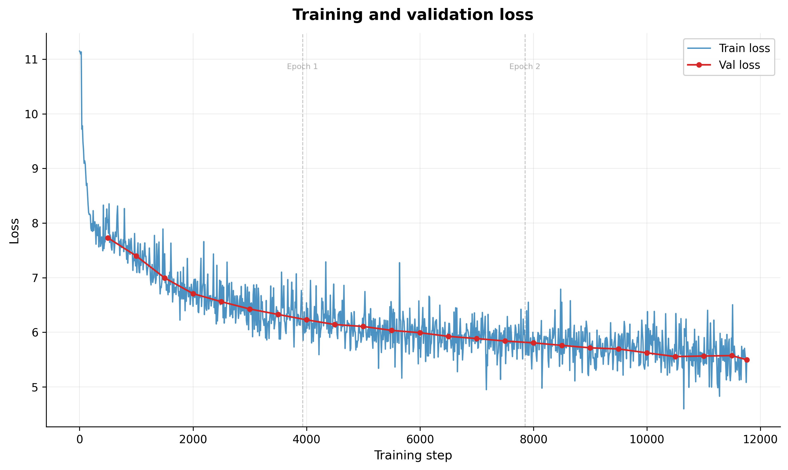
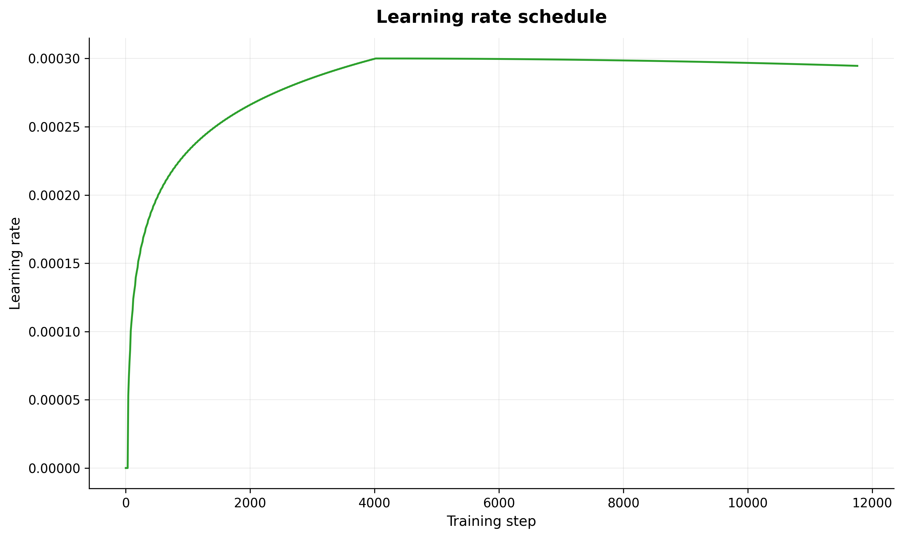

# Training Analysis Report

**Log:** training_log.jsonl
**Generated:** 2026-02-27 17:04 UTC
**Model:** 24L, 16H, 1280D, ctx=1024, dropout=0.1

## Training overview

The training ran for 11760 steps across 3 epoch(s), taking approximately 4h 27m of wall-clock time. The final training loss was 5.4727 and the final validation loss was 5.4956.

## Loss curves

Training loss decreased from 11.1484 to 5.5078 over 11760 steps, a 50.6% reduction. Validation loss tracked the training loss closely, falling from 7.7284 to 5.4956.

## Per-epoch breakdown

Metrics at each validation checkpoint, grouped by epoch.

|  Epoch | Train Loss | Val Loss | Relative Gap | Train PPL | Val PPL | Classification |
|--------|------------|----------|--------------|-----------|---------|----------------|
|      0 |     7.7298 |   7.7284 |      -0.0002 |   2275.25 | 2272.05 | Well-fit       |
|      0 |     7.4274 |   7.3973 |      -0.0040 |   1681.47 | 1631.64 | Well-fit       |
|      0 |     7.0574 |   6.9951 |      -0.0088 |   1161.42 | 1091.25 | Well-fit       |
|      0 |     6.7263 |   6.7079 |      -0.0027 |    834.06 |  818.89 | Well-fit       |
|      0 |     6.5093 |   6.5597 |      +0.0077 |    671.35 |  706.06 | Well-fit       |
|      0 |     6.4148 |   6.4261 |      +0.0018 |    610.80 |  617.77 | Well-fit       |
|      0 |     6.3274 |   6.3265 |      -0.0002 |    559.72 |  559.18 | Well-fit       |
|      1 |     6.1991 |   6.2279 |      +0.0046 |    492.32 |  506.70 | Well-fit       |
|      1 |     6.1838 |   6.1420 |      -0.0068 |    484.83 |  464.96 | Well-fit       |
|      1 |     6.1246 |   6.1063 |      -0.0030 |    456.95 |  448.65 | Well-fit       |
|      1 |     5.9818 |   6.0348 |      +0.0089 |    396.16 |  417.73 | Well-fit       |
|      1 |     5.9762 |   5.9922 |      +0.0027 |    393.92 |  400.30 | Well-fit       |
|      1 |     5.9233 |   5.9252 |      +0.0003 |    373.64 |  374.37 | Well-fit       |
|      1 |     5.8690 |   5.8850 |      +0.0027 |    353.90 |  359.60 | Well-fit       |
|      1 |     5.8524 |   5.8399 |      -0.0021 |    348.08 |  343.73 | Well-fit       |
|      2 |     5.8012 |   5.8065 |      +0.0009 |    330.69 |  332.45 | Well-fit       |
|      2 |     5.7546 |   5.7600 |      +0.0009 |    315.64 |  317.36 | Well-fit       |
|      2 |     5.6975 |   5.7154 |      +0.0031 |    298.13 |  303.50 | Well-fit       |
|      2 |     5.7252 |   5.6940 |      -0.0054 |    306.49 |  297.09 | Well-fit       |
|      2 |     5.6586 |   5.6240 |      -0.0061 |    286.75 |  277.00 | Well-fit       |
|      2 |     5.5820 |   5.5547 |      -0.0049 |    265.61 |  258.45 | Well-fit       |
|      2 |     5.5545 |   5.5657 |      +0.0020 |    258.40 |  261.31 | Well-fit       |
|      2 |     5.5211 |   5.5729 |      +0.0094 |    249.90 |  263.20 | Well-fit       |
|      2 |     5.4727 |   5.4956 |      +0.0042 |    238.09 |  243.63 | Well-fit       |

## Perplexity analysis

Train perplexity decreased from 2275.25 to 238.09. Validation perplexity moved from 2272.05 to 243.63. The growing gap between train and validation perplexity indicates increasing overfitting as training progressed.

## Learning rate schedule

The training used a WarmupCosineLR schedule with 500 warmup steps over 11763 total steps. The minimum LR ratio was set to 0.0, meaning the learning rate decayed to 0.0 of its peak value by the end of training.

## Overfitting diagnosis

**Classification: Well-fit**

The model shows a healthy training profile. The final validation loss (5.4956) is very close to the final training loss (5.4727), with a relative gap of +0.0042 (+0.42%). This indicates the model has learned generalizable patterns from the training data without significant memorization.

> **Warning:** Validation loss divergence detected starting around step 11000. Validation loss increased for 2+ consecutive checkpoints while training loss continued to decrease, a classic sign of overfitting.

## Recommendations

- The model is well-fit. The current training configuration appears appropriate for this dataset.
- If more training epochs are planned, monitor the validation loss closely for signs of divergence.
- Validation loss divergence was detected. Implement early stopping based on validation loss to prevent wasted compute on overfit training.
