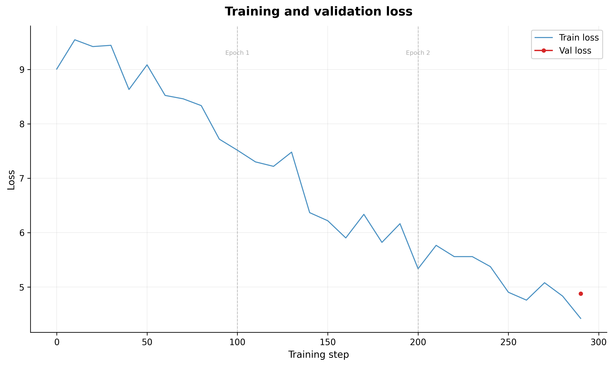
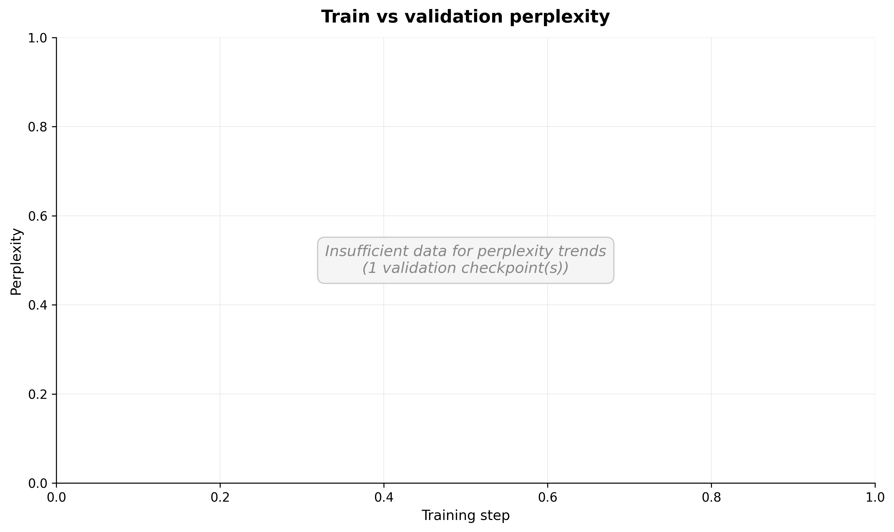
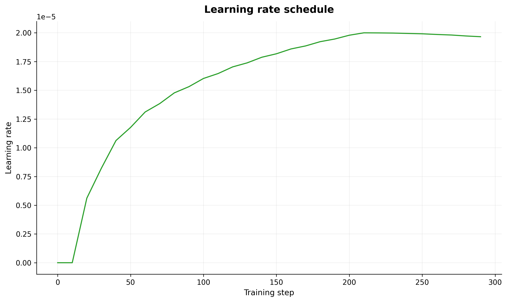

# Training Analysis Report

**Log:** sft_log.jsonl
**Generated:** 2026-03-20 15:35 UTC
**Model:** 30L, 20H, 1600D, ctx=1024, dropout=0.1

## Training overview

The training ran for 290 logged step(s) across 3 epoch(s), taking approximately 6m 47s of wall-clock time. The final training loss was 4.7404 and the final validation loss was 4.8782.

## Loss curves

Training loss decreased from 9.0078 to 4.4219 over 290 steps, a 50.9% reduction.

## Per-epoch breakdown

Metrics at each validation checkpoint, grouped by epoch.

|  Epoch | Train Loss | Val Loss | Relative Gap | Train PPL | Val PPL | Classification |
|--------|------------|----------|--------------|-----------|---------|----------------|
|      2 |     4.7404 |   4.8782 |      +0.0291 |    114.48 |  131.39 | Mild overfitting |

## Perplexity analysis

Only one validation checkpoint was recorded. Train perplexity: 114.48, validation perplexity: 131.39. Multiple checkpoints are needed to analyze perplexity trends.

## Learning rate schedule

The training used a WarmupCosineLR schedule with 50 warmup steps over 291 total steps. The minimum LR ratio was set to 0.0, meaning the learning rate decayed to 0.0 of its peak value by the end of training.

## Overfitting diagnosis

**Classification: Mild overfitting**

The model shows signs of mild overfitting. The validation loss (4.8782) exceeds the training loss (4.7404) by a relative gap of +0.0291 (+2.91%). While not severe, this suggests the model has begun memorizing training-specific patterns that do not generalize.

## Recommendations

- Consider increasing dropout (currently the primary regularization mechanism) to reduce overfitting.
- Early stopping at step 290 (val loss 4.8782) would have produced the best-generalizing checkpoint.
